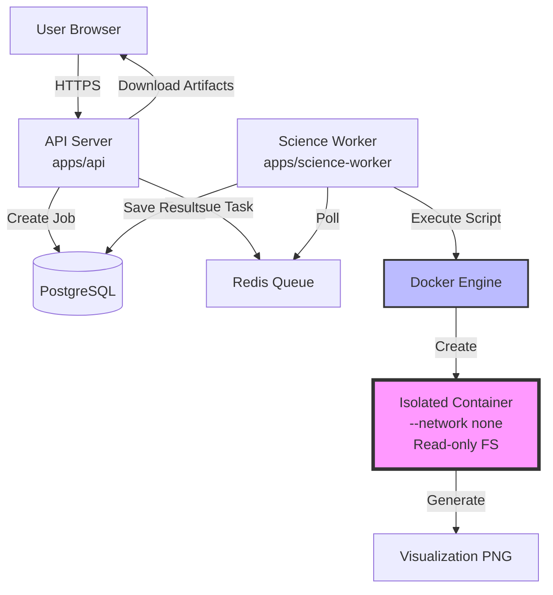

# OpenScience Sandbox 威胁模型文档

**版本**: 1.0  
**日期**: 2026-08-06  
**作者**: OpenScience Security Team  
**状态**: Draft - 待法律与安全审核  
**依据**: Spec §10.3, §17, §21.1, §23, §24

---

## Executive Summary

本文档提供 OpenScience Python 沙箱环境的系统化威胁分析。沙箱用于执行用户提交的 Python 可视化脚本，运行在隔离的 Docker 容器中，具备严格的网络、资源和文件系统限制。

**关键安全措施**：
- 完全禁止网络访问（`--network none`）
- 严格资源限制（1 CPU / 1 GB 内存 / 30s 超时）
- 只读根文件系统 + 临时目录 noexec
- 非 root 用户执行（UID 1000）
- 容器执行后立即销毁，不复用

**残留风险等级评估**：
- **高风险**: Docker 0-day 容器逃逸、沙箱与数据库同机部署
- **中风险**: 并发作业 DoS、策略绕过（代码混淆）、信息泄露（时序侧信道）
- **低风险**: 身份伪造（已有 RBAC）、审计日志篡改（不可变日志）

**生产开放前必做**：独立 ECS 部署、容器镜像安全扫描、监控告警、定期渗透测试。

---

## 1. System Overview

### 1.1 架构图

### 1.2 信任边界

| 边界 | 描述 | 信任假设 |
|------|------|---------|
| **用户 ↔ API** | HTTPS + 会话认证 | 用户已通过邀请码注册，恶意用户可能尝试提交攻击脚本 |
| **API ↔ Worker** | Redis 队列 + 内网通信 | Worker 受信任，API 已完成 RBAC 校验 |
| **Worker ↔ Docker** | Unix socket（只读挂载） | Worker 进程可能被 compromised，不信任用户脚本 |
| **Container ↔ Host** | Docker 隔离层 | 容器内代码完全不可信，假设恶意 |

### 1.3 数据流

1. **脚本提交**: 用户 → API (POST /sandbox-jobs) → 策略检查 (simple-policy.ts) → 入队
2. **脚本执行**: Worker 轮询 → Docker 创建容器 → 执行 Python 脚本 → 生成 PNG
3. **结果返回**: Worker 保存产物到 DB → API 提供下载 → 用户浏览器展示
4. **容器销毁**: 执行完成（成功/失败/超时）→ 立即 `docker rm -f`

---

## 2. Threat Model (STRIDE)

### 2.1 Spoofing (身份伪造)

**威胁**: 攻击者伪造其他用户身份访问私有数据或执行未授权操作。

**攻击向量**：
1. **会话劫持**: 窃取或伪造 session token
2. **跨 Workspace 越权**: 访问其他 workspace 的沙箱作业结果

**当前防御**：
- Session token：32 字节随机数（base64url）+ HttpOnly cookie + 7 天滑动 TTL
- RBAC 守卫：所有 API 端点强制校验 workspace 成员身份（[apps/api/src/routes/sandbox-jobs.ts:54-58](apps/api/src/routes/sandbox-jobs.ts#L54-L58)）
- 资源所有权检查：GET /sandbox-jobs/:id 验证 `job.workspaceId === req.workspaceId`（[apps/api/src/routes/sandbox-jobs.ts:127](apps/api/src/routes/sandbox-jobs.ts#L127)）

**残留风险**: **低**  
- Session 固定攻击：SameSite=Lax 已缓解
- 中间人攻击：生产环境强制 HTTPS + HSTS

---

### 2.2 Tampering (篡改)

**威胁**: 攻击者修改系统文件、Docker socket、或绕过安全限制。

**攻击向量**：
1. **修改宿主文件系统**: 容器逃逸后修改宿主机系统文件
2. **访问 Docker socket**: 通过 `/var/run/docker.sock` 创建特权容器
3. **修改容器镜像**: 污染基础镜像，持久化后门

**当前防御**：
- 只读根文件系统：`ReadonlyRootfs: true`（[apps/science-worker/src/sandbox-controller.ts:96](apps/science-worker/src/sandbox-controller.ts#L96)）
- 无 Docker socket 挂载：容器内无 `/var/run/docker.sock`
- 临时目录 noexec：`/tmp: 'size=100m,noexec'`（[apps/science-worker/src/sandbox-controller.ts:98](apps/science-worker/src/sandbox-controller.ts#L98)）
- 容器立即销毁：不复用，防止持久化污染（[apps/science-worker/src/sandbox-controller.ts:100](apps/science-worker/src/sandbox-controller.ts#L100)）

**残留风险**: **低**  
- Docker 0-day 漏洞可能绕过只读限制
- 镜像供应链攻击（缓解：使用官方 Python 镜像 + Trivy 扫描）

---

### 2.3 Repudiation (不可否认性)

**威胁**: 用户否认执行了恶意操作，系统无法提供审计证据。

**攻击向量**：
1. **删除审计日志**: 攻击者删除或篡改日志记录
2. **伪造操作时间**: 修改系统时钟掩盖攻击时间

**当前防御**：
- 审计日志不可变：审计表无 UPDATE/DELETE 权限（P1A-6 设计）
- 所有沙箱作业记录：userId, workspaceId, script, status, createdAt, completedAt
- 统一审计 sink：`packages/audit/src/sink.ts`，记录 IP、requestId、action

**残留风险**: **低**  
- 日志完整性依赖数据库访问控制
- 未实现日志签名（HMAC）或外部日志归档（P2 考虑）

---

### 2.4 Information Disclosure (信息泄露)

**威胁**: 攻击者读取敏感信息（数据库凭据、其他用户数据、云元数据）。

**攻击向量**：
1. **访问云元数据服务**: `http://169.254.169.254/latest/meta-data/`（AWS/Aliyun）
2. **读取环境变量**: 容器内读取注入的数据库密码
3. **旁路攻击**: Spectre/Meltdown 读取宿主内存
4. **时序侧信道**: 通过执行时间推断私有信息

**当前防御**：
- 完全禁止网络：`NetworkMode: 'none'`（[apps/science-worker/src/sandbox-controller.ts:102](apps/science-worker/src/sandbox-controller.ts#L102)）
- 不注入敏感环境变量：容器内无数据库凭据（[P1E-4 §3.1](docs/specs/2026-08-06-p1e-4-sandbox-controller-design.md#31-容器运行参数)）
- Docker 网络分段：沙箱容器无法访问 `data_net`（PostgreSQL 所在网络）

**残留风险**: **中**  
- **时序侧信道**: 攻击者可通过测量脚本执行时间推断系统状态（如数据库是否存在某记录）
  - 缓解：限制并发作业数，避免资源竞争导致时序差异
- **Spectre/Meltdown**: CPU 级漏洞，依赖云厂商硬件防护
- **同机部署泄露**: 沙箱与数据库同 ECS，理论上内核漏洞可突破网络隔离
  - **生产前必做**: 独立 ECS 部署

---

### 2.5 Denial of Service (拒绝服务)

**威胁**: 攻击者耗尽系统资源，导致合法用户无法使用。

**攻击向量**：
1. **资源耗尽**: 提交大量并发作业，耗尽 CPU/内存/磁盘
2. **恶意循环**: 提交无限循环脚本，占用容器资源
3. **输出洪水**: 打印大量输出，耗尽存储或内存

**当前防御**：
- 单作业资源限制：1 CPU / 1 GB 内存 / 30s 超时（[apps/science-worker/src/sandbox-controller.ts:34-38](apps/science-worker/src/sandbox-controller.ts#L34-L38)）
- 输出截断：1 MB 上限（[apps/science-worker/src/sandbox-controller.ts:37](apps/science-worker/src/sandbox-controller.ts#L37)）
- 配额限流：每月作业数限制（P1E-5 配额检查）
- 进程数限制：`PidsLimit: 64`（[apps/science-worker/src/sandbox-controller.ts:38](apps/science-worker/src/sandbox-controller.ts#L38)）

**残留风险**: **中**  
- **并发作业 DoS**: 单用户提交数百个作业，耗尽 Docker 资源池
  - 当前缓解：月配额限制（如 100 作业/月）
  - **生产前必做**: 独立 ECS + 动态扩容 + 实时监控告警
- **慢速攻击**: 提交恰好 30s 完成的作业，绕过超时但占用资源
  - 缓解：严格并发数限制（如最多 5 个并发容器/workspace）

---

### 2.6 Elevation of Privilege (权限提升)

**威胁**: 攻击者从容器内普通用户提升为 root，或逃逸到宿主机。

**攻击向量**：
1. **容器逃逸**: 利用 Docker 内核漏洞逃逸到宿主机
2. **特权提升**: 容器内从 sandbox 用户提升为 root
3. **Capabilities 滥用**: 利用保留的 Linux capabilities 执行特权操作
4. **设备节点创建**: 创建块设备节点访问磁盘

**当前防御**：
- 非 root 用户：`User: 'sandbox'` (UID 1000)（[apps/science-worker/src/sandbox-controller.ts:114](apps/science-worker/src/sandbox-controller.ts#L114)）
- Capabilities drop：移除所有特权 capabilities（P1E-4 设计，待实装）
- No new privileges：`SecurityOpt: ['no-new-privileges:true']`（P1E-4 设计，待实装）
- 禁止挂载：无宿主目录挂载（[apps/science-worker/src/sandbox-controller.ts:108](apps/science-worker/src/sandbox-controller.ts#L108)）

**残留风险**: **高**  
- **Docker 0-day 漏洞**: runc/containerd/Docker Engine 内核漏洞可能导致容器逃逸
  - 历史案例：CVE-2019-5736 (runc), CVE-2022-0847 (Dirty Pipe)
  - 缓解：及时更新 Docker 版本 + 订阅 CVE 通知
- **内核漏洞**: Linux 内核本身的权限提升漏洞（如 Dirty COW）
  - 缓解：宿主机内核及时打补丁 + 考虑 gVisor/Kata Containers 虚拟化隔离（P2）

---

## 3. Attack Scenarios (具体攻击场景)

### 3.1 网络突破尝试

**场景**: 攻击者尝试从容器内发起网络请求，访问外部服务或内网资源。

**攻击手段**：
1. **DNS 隧道**: 通过 DNS 查询传输数据
2. **ICMP 隧道**: 通过 ping 包传输数据
3. **云元数据访问**: `curl http://169.254.169.254/latest/meta-data/iam/security-credentials/`

**防御效果**：
- ✅ 完全阻断：`--network none` 禁用所有网络栈
- ✅ 基线测试验证：Test 1, 2, 3（[apps/science-worker/test/sandbox-security.test.ts:11-54](apps/science-worker/test/sandbox-security.test.ts#L11-L54)）

**残留风险**: **低**  
- 时序侧信道：虽然无网络，但可通过执行时间推断外部状态（如数据库负载）

---

### 3.2 容器逃逸

**场景**: 攻击者利用 Docker 漏洞逃逸到宿主机，获取 root 权限。

**攻击手段**：
1. **runc 漏洞**: CVE-2019-5736，覆盖宿主 runc 二进制
2. **Dirty Pipe**: CVE-2022-0847，覆盖只读文件
3. **proc 伪文件系统**: 读取 `/proc/self/root/../../../` 访问宿主文件系统

**防御效果**：
- ⚠️ 依赖 Docker 版本无漏洞：需及时更新
- ✅ 只读根 FS：降低利用难度
- ✅ 非 root 用户：限制容器内权限

**残留风险**: **高**  
- Docker/runc 0-day 漏洞尚未公开时，系统无防御能力
- **生产前必做**：
  - Docker 版本锁定 + CVE 监控订阅
  - 考虑 gVisor（用户态内核）或 Kata Containers（VM 隔离）

---

### 3.3 资源耗尽攻击

**场景**: 攻击者提交恶意脚本，耗尽系统资源，影响其他用户。

**攻击手段**：
1. **Fork 炸弹**: `while True: os.fork()` 快速创建进程
2. **内存炸弹**: `huge_array = np.zeros((1024, 1024, 1024))` 分配 8 GB 内存
3. **磁盘炸弹**: 在 `/tmp` 创建大量文件耗尽 inode

**防御效果**：
- ✅ 进程数限制：`PidsLimit: 64` 阻止 fork 炸弹
- ✅ 内存限制：1 GB，超限被 OOM killer 杀死
- ✅ /tmp 大小限制：100 MB tmpfs
- ✅ 基线测试验证：Test 4, 5（[apps/science-worker/test/sandbox-security.test.ts:56-91](apps/science-worker/test/sandbox-security.test.ts#L56-L91)）

**残留风险**: **中**  
- 并发作业 DoS：单 workspace 提交 100 个作业，耗尽 Docker 资源池
  - 缓解：并发数限制（如 5 个/workspace）+ 队列优先级

---

### 3.4 策略绕过

**场景**: 攻击者通过代码混淆绕过策略检查，执行禁止操作。

**攻击手段**：
1. **动态导入**: `__import__('o' + 's').system('ls')`
2. **Base64 编码**: `eval(__import__('base64').b64decode('aW1wb3J0IG9z'))`
3. **字符串拼接**: `getattr(__builtins__, 'ev' + 'al')('import os')`

**防御效果**：
- ⚠️ 简化版策略检查（P1E-7）：仅检测字面 `import os`，无法检测混淆
- ✅ 网络隔离兜底：即使导入 `os`，也无法网络通信

**残留风险**: **中**  
- 策略可被绕过，但沙箱容器限制仍生效（深度防御）
- **后续任务 P1E-3**：完整 Python AST 分析引擎，检测语义级违规

---

### 3.5 数据泄露

**场景**: 攻击者读取其他用户的私有数据或系统敏感信息。

**攻击手段**：
1. **跨 workspace 越权**: 猜测其他作业 ID，尝试下载产物
2. **云元数据读取**: 获取 IAM 凭据访问云资源
3. **/proc 信息泄露**: 读取 `/proc/self/environ` 获取环境变量

**防御效果**：
- ✅ RBAC 守卫：API 层强制校验 `job.workspaceId === req.workspaceId`
- ✅ 无网络：无法访问云元数据服务
- ✅ 无敏感环境变量：容器内不注入数据库密码

**残留风险**: **低**  
- API 越权漏洞：如某个端点忘记校验 workspaceId
  - 缓解：统一 preHandler 中间件 + 代码审查

---

## 4. Defense in Depth (多层防御)

| 层级 | 防御措施 | 失效后果 |
|------|---------|---------|
| **L1: 策略检查** | 简化版黑名单 (P1E-7) | 恶意脚本仍可能被执行 |
| **L2: 网络隔离** | `--network none` | 无法访问外部服务，即使脚本导入 `requests` |
| **L3: 文件系统隔离** | 只读根 FS + /tmp noexec | 无法持久化后门，无法执行二进制 |
| **L4: 资源限制** | 1 CPU / 1 GB / 30s / 64 进程 | DoS 攻击被限制在单容器范围 |
| **L5: 容器隔离** | Docker namespaces + cgroups | 容器逃逸前，攻击被隔离 |
| **L6: 审计日志** | 不可变审计表 | 即使攻击成功，也可追溯来源 |
| **L7: RBAC** | API 层权限校验 | 跨 workspace 越权被阻断 |

**关键原则**: 每一层防御独立生效。即使 L1 策略检查被绕过，L2-L7 仍能阻止攻击。

---

## 5. Residual Risks (残留风险评估)

### 5.1 高风险

| 风险 | 影响 | 缓解措施 | 优先级 |
|------|------|---------|---------|
| **Docker 0-day 容器逃逸** | 攻击者获取宿主机 root 权限，读取数据库数据 | 及时更新 Docker + CVE 监控 + 考虑 gVisor | P0 |
| **沙箱与数据库同机部署** | 容器逃逸后可直接访问数据库文件 | 独立 ECS 部署（§23 风险 5） | **生产前必做** |

### 5.2 中风险

| 风险 | 影响 | 缓解措施 | 优先级 |
|------|------|---------|---------|
| **并发作业 DoS** | 单用户提交大量作业，耗尽系统资源 | 并发数限制 + 队列优先级 + 监控告警 | P1 |
| **策略绕过（混淆）** | 恶意脚本执行禁止操作（但仍受容器限制） | P1E-3 AST 引擎 | P1E-3 |
| **时序侧信道** | 推断私有信息（如数据库记录存在性） | 限制并发 + 随机延迟 | P2 |

### 5.3 低风险

| 风险 | 影响 | 缓解措施 | 优先级 |
|------|------|---------|---------|
| **Session 劫持** | 攻击者冒充合法用户 | HttpOnly + SameSite + HTTPS + HSTS | P2 |
| **审计日志删除** | 攻击证据被销毁 | 数据库访问控制 + 外部日志归档 | P2 |

---

## 6. Mitigation Roadmap (缓解路线图)

### 6.1 生产前必做 (P0)

- [ ] **独立 ECS 部署**: 沙箱 worker 与数据库物理隔离（§23 风险 5）
- [ ] **容器镜像安全扫描**: Trivy / Clair 集成 CI，检测已知 CVE
- [ ] **监控告警**: 
  - 沙箱作业失败率 > 10% 告警
  - 容器创建失败率 > 5% 告警
  - Docker daemon CPU/内存 > 80% 告警
- [ ] **法律审核**: 免责声明合规性确认（见 [sandbox-security-statement.md](sandbox-security-statement.md)）
- [ ] **Docker 版本锁定**: 生产环境使用经过安全测试的固定版本

### 6.2 短期改进 (P1, 3 个月内)

- [ ] **P1E-3 AST 引擎**: 完整 Python AST 分析，检测语义级违规
- [ ] **并发数限制**: 单 workspace 最多 5 个并发容器
- [ ] **队列优先级**: 付费用户优先级更高，防止免费用户 DoS
- [ ] **定期渗透测试**: 聘请第三方安全团队，季度执行一次

### 6.3 中期改进 (P2, 6-12 个月)

- [ ] **gVisor / Kata Containers**: 用户态内核或 VM 隔离，降低容器逃逸风险
- [ ] **WAF 集成**: 检测恶意脚本提交模式（如大量重复提交）
- [ ] **外部日志归档**: 审计日志推送到 S3/OSS，防止篡改
- [ ] **内核安全模块**: AppArmor / SELinux 强制访问控制
- [ ] **时序侧信道防御**: 随机延迟 + 资源池隔离

---

## 7. Incident Response (事件响应)

### 7.1 容器逃逸检测

**指标**：
- 宿主机出现未授权进程
- Docker daemon CPU/内存异常飙升
- 审计日志出现异常 API 调用（如大量 404）

**响应流程**：
1. **立即隔离**: 停止所有沙箱容器，禁用新作业提交
2. **取证分析**: 保留宿主机快照，审计日志导出
3. **根因分析**: 确定利用的 CVE 或漏洞
4. **补丁修复**: 更新 Docker / 内核 / 应用代码
5. **恢复服务**: 独立环境验证修复后，恢复生产
6. **用户通知**: 如涉及数据泄露，按 GDPR 72 小时内通知

### 7.2 DoS 攻击检测

**指标**：
- 单 workspace 作业提交速率异常（如 100 个/分钟）
- Redis 队列长度持续增长
- 合法用户报告服务不可用

**响应流程**：
1. **限流加固**: 紧急降低该 workspace 配额（如 10 个/小时）
2. **账号冻结**: 如确认恶意，暂停账号并通知
3. **清理队列**: 删除该 workspace 待处理作业
4. **根因分析**: 确认是否为自动化脚本攻击
5. **CAPTCHA**: 考虑添加人机验证

---

## 8. Security Testing (安全测试)

### 8.1 现有基线测试

**文件**: `apps/science-worker/test/sandbox-security.test.ts`

| Test | 类别 | 验证内容 |
|------|------|---------|
| Test 1 | 网络隔离 | 阻止公网访问 (8.8.8.8:53) |
| Test 2 | 网络隔离 | 阻止云元数据 (169.254.169.254) |
| Test 3 | 网络隔离 | 阻止内网访问 (PostgreSQL) |
| Test 4 | 资源限制 | 内存限制 1 GB |
| Test 5 | 资源限制 | 输出截断 1 MB |
| Test 6 | 资源限制 | 30s 超时 |
| Test 7 | 文件系统 | 只读根 FS |
| Test 8 | 文件系统 | /tmp noexec |

### 8.2 新增逃逸测试 (P1E-8)

**文件**: `apps/science-worker/test/sandbox-escape.test.ts` (本任务新增)

| Test | 类别 | 验证内容 |
|------|------|---------|
| Test 9 | 容器逃逸 | 阻止 Docker socket 访问 |
| Test 10 | 容器逃逸 | 阻止特权提升 (sudo/su) |
| Test 11 | 容器逃逸 | 阻止 capabilities 滥用 |
| Test 12 | 容器逃逸 | 阻止设备节点创建 (mknod) |
| Test 13 | 策略绕过 | 检测动态导入混淆 |
| Test 14 | 策略绕过 | 检测 Base64 编码导入 |
| Test 15 | 策略绕过 | 检测字符串拼接绕过 |
| Test 16 | 策略绕过 | 检测合法库漏洞利用 (pickle) |

**执行频率**: CI 每次提交自动运行，生产部署前手动运行

---

## 9. References

- **Spec §10.3**: 沙箱全部限制（网络/资源/文件系统/超时）
- **Spec §17**: 安全与隐私 MUST 要求
- **Spec §21.1**: 安全测试层要求
- **Spec §23**: 风险跟踪（独立 ECS 迁移）
- **Spec §24**: 生产前待确认项（免责声明）
- **P1E-4 设计**: [apps/science-worker Sandbox Controller](../specs/2026-08-06-p1e-4-sandbox-controller-design.md)
- **P1E-7 设计**: [Script Modification](../specs/2026-08-06-p1e-7-script-modification-design.md)
- **OWASP Container Security**: https://cheatsheetseries.owasp.org/cheatsheets/Docker_Security_Cheat_Sheet.html
- **STRIDE Threat Modeling**: https://learn.microsoft.com/en-us/azure/security/develop/threat-modeling-tool-threats

---

## 10. Change Log

| 日期 | 版本 | 变更 | 作者 |
|------|------|------|------|
| 2026-08-06 | 1.0 | 初稿：8 类威胁 + 残留风险评估 + 缓解路线图 | OpenScience Security Team |

---

**审核状态**:  
- [ ] 技术审核（安全工程师）
- [ ] 法律审核（法务团队确认免责声明）
- [ ] 管理层批准

**下次审核日期**: 2026-09-06（每月更新）
