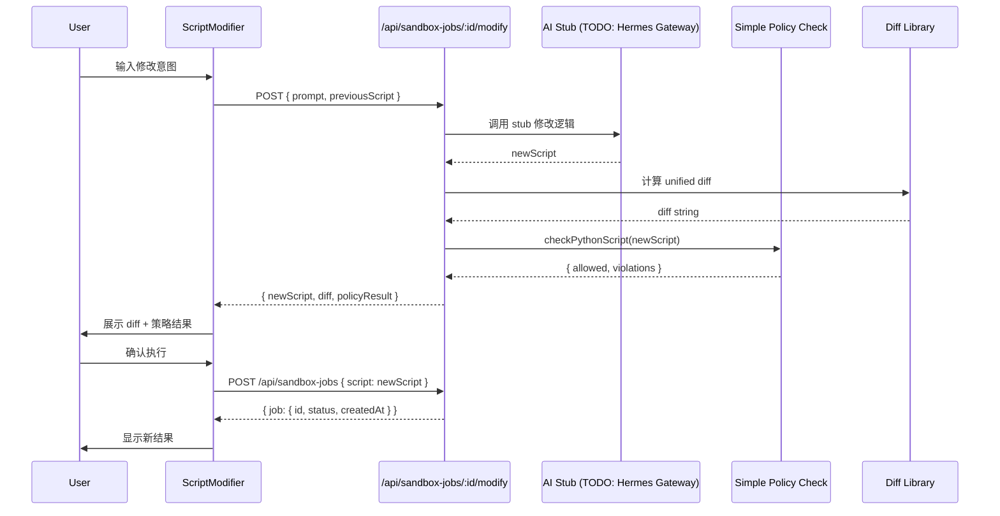

# P1E-7 自然语言修改脚本与 diff 展示设计文档

**任务**: 实现自然语言修改 Python 可视化脚本与 diff 预览  
**设计者**: Claude Opus 4.8  
**创建日期**: 2026-08-06  
**前置**: P1E-6 (Visualization Result Display)  
**参考规格**: Spec §10.4

---

## 1. 目标

实现用户用自然语言修改已生成的 Python 可视化脚本的完整流程，包括：

1. **自然语言输入**：用户描述修改意图（如 "将曲线颜色改为红色"、"增加标题"）
2. **AI 脚本生成**：基于意图生成新脚本（暂用 stub，P1D-2 后接入 Hermes Gateway）
3. **Diff 展示**：新旧脚本对比，红色删除行 + 绿色新增行
4. **策略检查**：重新进行安全策略检查（简化版黑名单，P1E-3 后升级为 AST）
5. **新容器执行**：禁止复用可能已污染的容器（Spec §10.4 要求）

### 1.1 用户场景

```text
用户在 VisualizationResult 组件中查看已完成的可视化结果
  ↓
点击"修改脚本"按钮，弹出 ScriptModifier 对话框
  ↓
输入修改意图："将曲线颜色改为红色" / "增加图表标题" / "调整 x 轴范围为 0-10"
  ↓
点击"生成预览"，调用 POST /api/sandbox-jobs/:jobId/modify
  ↓
后端返回：新脚本 + diff + 策略检查结果
  ↓
前端展示 diff（红色删除行 + 绿色新增行）+ 策略结果（✅ 通过 / ❌ 阻断）
  ↓
用户确认后，点击"执行新脚本"，创建新 sandbox job (POST /api/sandbox-jobs)
  ↓
关闭 ScriptModifier 对话框，展示新结果（复用 VisualizationResult 组件）
```

### 1.2 验收标准 (Spec §21.2)

- ✅ 用户输入自然语言修改意图，系统生成新脚本
- ✅ Diff 展示清晰标注删除/新增行
- ✅ 策略检查阻断违规脚本（forbidden imports）
- ✅ 确认后创建新 sandbox job，不复用旧容器
- ✅ 新结果展示在 VisualizationResult 组件中

---

## 2. 架构决策

### 2.1 技术栈

| 组件 | 选型 | 理由 |
|------|------|------|
| Diff 库 (后端) | `diff` npm 包 | 成熟稳定，unified diff 格式 |
| AI 脚本修改 (暂时) | Stub 逻辑 | P1D-2 Hermes Gateway 未实现，先用关键词匹配 |
| 策略检查 (暂时) | 简化版黑名单 | P1E-3 AST 引擎未实现，先检查 import 黑名单 |
| 前端 Diff 展示 | 简单 `<pre>` 着色 | 无 Monaco Editor 依赖，快速实现 |
| 状态管理 | React useState | 轻量，无需 Redux/Zustand |

### 2.2 数据流



### 2.3 前置依赖缺失处理

**问题 1**: P1E-3 Python AST 策略检查引擎未实现  
**方案**: 实现简化版黑名单检查（检测 `os`, `subprocess`, `socket`, `ctypes`, `requests`, `urllib` 等 forbidden imports）

**问题 2**: P1D-2 Hermes Gateway 未实现  
**方案**: 实现 stub AI 修改逻辑（关键词匹配 + 简单字符串替换），标注 `# Modified by stub AI logic`

---

## 3. 后端实现规格

### 3.1 新增 API 路由 (apps/api/src/routes/sandbox-jobs.ts)

```typescript
// POST /api/sandbox-jobs/:jobId/modify
// Body: { prompt: string }
// Response: { newScript: string, diff: string, policyResult: PolicyCheckResult }

interface ModifyScriptRequest {
  prompt: string;
}

interface ModifyScriptResponse {
  newScript: string;
  diff: string; // unified diff format
  policyResult: {
    allowed: boolean;
    violations: string[];
  };
}

const modifyJobSchema = z.object({
  prompt: z.string().min(1).max(2000),
});

app.post<{ Params: z.infer<typeof jobIdParams>; Body: z.infer<typeof modifyJobSchema> }>(
  '/sandbox-jobs/:jobId/modify',
  {
    preHandler: [
      // @ts-expect-error
      app.authenticate,
      // @ts-expect-error
      app.checkWorkspaceAccess,
    ],
  },
  async (req, reply) => {
    const { jobId } = jobIdParams.parse(req.params);
    const { prompt } = modifyJobSchema.parse(req.body);
    const workspaceId = (req as any).workspaceId;

    // 1. 获取原作业脚本
    const job = await getSandboxJob(deps, jobId);
    if (!job || job.workspaceId !== workspaceId) {
      return reply.status(404).send({ error: { code: 'NOT_FOUND', message: '作业未找到' } });
    }

    // 2. 调用 AI 修改脚本 (stub)
    const newScript = modifyScriptStub(job.script, prompt);

    // 3. 计算 diff
    const diffResult = createTwoFilesPatch(
      'previous.py',
      'modified.py',
      job.script,
      newScript,
      '',
      '',
    );

    // 4. 策略检查
    const policyResult = checkPythonScript(newScript);

    return reply.send({
      newScript,
      diff: diffResult,
      policyResult,
    });
  },
);
```

### 3.2 AI 脚本修改 Stub (packages/domain/src/sandbox/script-modifier.ts)

```typescript
/**
 * P1E-7 临时 stub: 简单关键词匹配修改脚本
 * TODO: P1D-2 后替换为 Hermes Gateway 调用
 */
export function modifyScriptStub(originalScript: string, prompt: string): string {
  let modified = originalScript;
  
  // 关键词匹配规则
  const rules = [
    { pattern: /color.*red/i, action: () => modified = modified.replace(/color\s*=\s*['"][^'"]+['"]/, "color='red'") },
    { pattern: /color.*blue/i, action: () => modified = modified.replace(/color\s*=\s*['"][^'"]+['"]/, "color='blue'") },
    { pattern: /title/i, action: () => {
        if (!modified.includes('plt.title')) {
          modified = modified.replace(/plt\.plot\([^)]+\)/, "$&\nplt.title('Modified Visualization')");
        }
      }
    },
    { pattern: /xlabel/i, action: () => {
        const match = prompt.match(/xlabel\s*['"]([^'"]+)['"]/i);
        if (match) {
          modified = modified.replace(/plt\.xlabel\([^)]+\)/, `plt.xlabel('${match[1]}')`);
        }
      }
    },
  ];

  for (const rule of rules) {
    if (rule.pattern.test(prompt)) {
      rule.action();
    }
  }

  // 标注修改来源
  if (modified !== originalScript) {
    modified = `# Modified by stub AI logic based on: "${prompt}"\n\n` + modified;
  }

  return modified;
}
```

### 3.3 简化版策略检查 (packages/domain/src/sandbox/simple-policy.ts)

```typescript
/**
 * P1E-7 简化版策略检查（黑名单 import）
 * TODO: P1E-3 完整 AST 分析后替换
 */
export interface PolicyCheckResult {
  allowed: boolean;
  violations: string[];
}

export function checkPythonScript(script: string): PolicyCheckResult {
  const violations: string[] = [];
  
  // Spec §10.3 禁止模块
  const forbiddenModules = [
    'os', 'subprocess', 'socket', 'ctypes',
    'requests', 'urllib', 'urllib2', 'urllib3',
    'http', 'ftplib', 'telnetlib', 'smtplib',
    '__import__', 'eval', 'exec', 'compile',
  ];

  for (const module of forbiddenModules) {
    const patterns = [
      new RegExp(`^\\s*import\\s+${module}\\b`, 'm'),
      new RegExp(`^\\s*from\\s+${module}\\s+import`, 'm'),
      new RegExp(`__import__\\s*\\(\\s*['"\`]${module}['"\`]\\s*\\)`, 'm'),
    ];

    for (const pattern of patterns) {
      if (pattern.test(script)) {
        violations.push(`Forbidden module or function: ${module}`);
        break;
      }
    }
  }

  return {
    allowed: violations.length === 0,
    violations,
  };
}
```

---

## 4. 前端实现规格

### 4.1 ScriptModifier 组件 (apps/web/components/sandbox/ScriptModifier.tsx)

```typescript
'use client';

import { useState } from 'react';
import type { ModifyScriptResponse } from '@/lib/api';
import { modifyScript, createSandboxJob } from '@/lib/api';

interface Props {
  jobId: string;
  workspaceId: string;
  currentScript: string;
  onClose: () => void;
  onModifyComplete: (newJobId: string) => void;
}

export default function ScriptModifier({
  jobId,
  workspaceId,
  currentScript,
  onClose,
  onModifyComplete,
}: Props) {
  const [prompt, setPrompt] = useState('');
  const [preview, setPreview] = useState<ModifyScriptResponse | null>(null);
  const [loading, setLoading] = useState(false);
  const [executing, setExecuting] = useState(false);
  const [error, setError] = useState<string | null>(null);

  async function handleGeneratePreview() {
    if (!prompt.trim()) return;
    setLoading(true);
    setError(null);
    
    try {
      const result = await modifyScript(jobId, { prompt });
      setPreview(result);
    } catch (err) {
      setError(err instanceof Error ? err.message : '生成预览失败');
    } finally {
      setLoading(false);
    }
  }

  async function handleExecute() {
    if (!preview) return;
    setExecuting(true);
    setError(null);

    try {
      const job = await createSandboxJob({ script: preview.newScript });
      onModifyComplete(job.id);
      onClose();
    } catch (err) {
      setError(err instanceof Error ? err.message : '执行失败');
    } finally {
      setExecuting(false);
    }
  }

  return (
    <div className="script-modifier-overlay">
      <div className="script-modifier">
        <div className="modifier-header">
          <h2>修改脚本</h2>
          <button onClick={onClose} className="close-btn">✕</button>
        </div>

        <div className="modifier-body">
          {/* 修改意图输入 */}
          <div className="prompt-section">
            <label htmlFor="modify-prompt">描述你想要的修改：</label>
            <textarea
              id="modify-prompt"
              value={prompt}
              onChange={(e) => setPrompt(e.target.value)}
              placeholder="例如: 将曲线颜色改为红色, 增加标题, 调整 x 轴范围"
              rows={3}
              disabled={loading || executing}
            />
            <button
              onClick={handleGeneratePreview}
              disabled={!prompt.trim() || loading || executing}
              className="preview-btn"
            >
              {loading ? '生成中...' : '生成预览'}
            </button>
          </div>

          {/* 错误提示 */}
          {error && <div className="error-message">{error}</div>}

          {/* 预览区域 */}
          {preview && (
            <div className="preview-section">
              {/* 策略检查结果 */}
              <div className={`policy-check ${preview.policyResult.allowed ? 'allowed' : 'blocked'}`}>
                {preview.policyResult.allowed ? (
                  <span>✅ 策略检查通过</span>
                ) : (
                  <>
                    <span>❌ 策略检查阻断</span>
                    <ul>
                      {preview.policyResult.violations.map((v, i) => (
                        <li key={i}>{v}</li>
                      ))}
                    </ul>
                  </>
                )}
              </div>

              {/* Diff 展示 */}
              <div className="diff-viewer">
                <h3>脚本差异</h3>
                <pre>{formatDiff(preview.diff)}</pre>
              </div>

              {/* 执行按钮 */}
              {preview.policyResult.allowed && (
                <button
                  onClick={handleExecute}
                  disabled={executing}
                  className="execute-btn"
                >
                  {executing ? '执行中...' : '确认执行'}
                </button>
              )}
            </div>
          )}
        </div>
      </div>
    </div>
  );
}

function formatDiff(unifiedDiff: string): string {
  // 简单着色处理（通过 CSS class）
  return unifiedDiff;
}
```

### 4.2 集成到 VisualizationResult (apps/web/components/sandbox/VisualizationResult.tsx)

```typescript
// 在现有组件末尾添加

const [showModifier, setShowModifier] = useState(false);

return (
  <div className="visualization-result">
    {/* 现有内容 ... */}
    
    {/* 底部操作区 */}
    <div className="result-actions">
      <button onClick={() => setShowModifier(true)} className="modify-btn">
        修改脚本
      </button>
    </div>

    {/* 修改对话框 */}
    {showModifier && (
      <ScriptModifier
        jobId={jobId}
        workspaceId={workspaceId}
        currentScript={job?.script || ''}
        onClose={() => setShowModifier(false)}
        onModifyComplete={(newJobId) => {
          setShowModifier(false);
          // 可选: 切换到新结果
        }}
      />
    )}
  </div>
);
```

### 4.3 API Client 扩展 (apps/web/lib/api.ts)

```typescript
export interface ModifyScriptRequest {
  prompt: string;
}

export interface ModifyScriptResponse {
  newScript: string;
  diff: string;
  policyResult: {
    allowed: boolean;
    violations: string[];
  };
}

export async function modifyScript(
  jobId: string,
  request: ModifyScriptRequest
): Promise<ModifyScriptResponse> {
  const res = await fetch(`/api/sandbox-jobs/${jobId}/modify`, {
    method: 'POST',
    headers: { 'Content-Type': 'application/json' },
    body: JSON.stringify(request),
    credentials: 'include',
  });

  if (!res.ok) {
    const error = await res.json().catch(() => ({ error: { message: 'Network error' } }));
    throw new Error(error.error?.message || 'Modify script failed');
  }

  return res.json();
}
```

---

## 5. 样式设计 (apps/web/app/globals.css)

```css
/* Script Modifier 对话框 */
.script-modifier-overlay {
  position: fixed;
  top: 0;
  left: 0;
  width: 100vw;
  height: 100vh;
  background: rgba(0, 0, 0, 0.5);
  display: flex;
  justify-content: center;
  align-items: center;
  z-index: 1000;
}

.script-modifier {
  background: white;
  border-radius: 8px;
  width: 90%;
  max-width: 800px;
  max-height: 90vh;
  overflow: auto;
  box-shadow: 0 4px 12px rgba(0, 0, 0, 0.15);
}

.modifier-header {
  display: flex;
  justify-content: space-between;
  align-items: center;
  padding: 16px 20px;
  border-bottom: 1px solid var(--color-border);
}

.modifier-header h2 {
  margin: 0;
  font-size: 1.3em;
}

.close-btn {
  background: none;
  border: none;
  font-size: 1.5em;
  cursor: pointer;
  color: var(--color-muted);
}

.close-btn:hover {
  color: var(--color-text);
}

.modifier-body {
  padding: 20px;
}

/* 修改意图输入 */
.prompt-section {
  margin-bottom: 20px;
}

.prompt-section label {
  display: block;
  margin-bottom: 8px;
  font-weight: 600;
}

.prompt-section textarea {
  width: 100%;
  padding: 10px;
  border: 1px solid var(--color-border);
  border-radius: 4px;
  font-family: inherit;
  font-size: 0.95em;
  resize: vertical;
}

.preview-btn, .execute-btn, .modify-btn {
  padding: 10px 20px;
  border: none;
  border-radius: 4px;
  font-weight: 600;
  cursor: pointer;
  transition: background 0.2s;
}

.preview-btn {
  background: #2563eb;
  color: white;
  margin-top: 10px;
}

.preview-btn:hover:not(:disabled) {
  background: #1e40af;
}

.preview-btn:disabled {
  background: #9ca3af;
  cursor: not-allowed;
}

/* 策略检查结果 */
.policy-check {
  padding: 12px;
  border-radius: 4px;
  margin-bottom: 16px;
}

.policy-check.allowed {
  background: #d4edda;
  border: 1px solid #c3e6cb;
  color: #155724;
}

.policy-check.blocked {
  background: #f8d7da;
  border: 1px solid #f5c6cb;
  color: #721c24;
}

.policy-check ul {
  margin: 8px 0 0 0;
  padding-left: 20px;
}

/* Diff 展示 */
.diff-viewer {
  background: #f8f9fa;
  border: 1px solid var(--color-border);
  border-radius: 4px;
  padding: 16px;
  margin-bottom: 16px;
}

.diff-viewer h3 {
  margin-top: 0;
  margin-bottom: 12px;
  font-size: 1.1em;
}

.diff-viewer pre {
  background: white;
  padding: 12px;
  border-radius: 4px;
  overflow-x: auto;
  font-size: 0.85em;
  line-height: 1.5;
  white-space: pre-wrap;
  word-break: break-all;
}

/* Diff 行着色 */
.diff-viewer pre {
  color: #24292e;
}

.diff-viewer pre::before {
  content: attr(data-line-type);
}

/* 执行按钮 */
.execute-btn {
  background: #16a34a;
  color: white;
  width: 100%;
}

.execute-btn:hover:not(:disabled) {
  background: #15803d;
}

.execute-btn:disabled {
  background: #9ca3af;
  cursor: not-allowed;
}

/* 结果操作区 */
.result-actions {
  margin-top: 20px;
  padding-top: 16px;
  border-top: 1px solid var(--color-border);
}

.modify-btn {
  background: #2563eb;
  color: white;
}

.modify-btn:hover {
  background: #1e40af;
}
```

---

## 6. 实施步骤

1. ✅ 探索现有代码结构（已完成）
2. 📝 编写本设计文档
3. 📝 编写实施计划
4. 🔧 后端实现:
   - 安装 `diff` 包 (apps/api)
   - 实现 `packages/domain/src/sandbox/simple-policy.ts`
   - 实现 `packages/domain/src/sandbox/script-modifier.ts`
   - 添加 `/sandbox-jobs/:jobId/modify` 路由
5. 🎨 前端实现:
   - 扩展 `apps/web/lib/api.ts` (modifyScript 函数)
   - 实现 `apps/web/components/sandbox/ScriptModifier.tsx`
   - 集成到 `apps/web/components/sandbox/VisualizationResult.tsx`
   - 添加样式到 `apps/web/app/globals.css`
6. ✅ TypeScript 类型检查
7. 📋 Git 提交

---

## 7. 验收标准

- ✅ 用户可在 VisualizationResult 中点击"修改脚本"
- ✅ 输入自然语言修改意图（如 "change color to red"）
- ✅ 生成预览后展示 diff（删除/新增行清晰可辨）
- ✅ 策略检查阻断违规脚本（forbidden imports）
- ✅ 确认执行后创建新 sandbox job，不复用旧容器
- ✅ 新结果展示在新的 VisualizationResult 实例中

---

## 8. 后续任务

- **P1E-3**: 完整 Python AST 策略检查引擎（替换简化版黑名单）
- **P1D-2**: Hermes Gateway 集成（替换 stub AI 修改逻辑）
- **P1E-8**: 沙箱威胁模型文档与逃逸基线测试
- **P1F**: 保存到个人笔记功能（需笔记数据模型）

---

**设计确认**: 本设计对齐 Spec §10.4 修改重新生成要求。由于前置任务 P1E-3 (AST 策略检查) 和 P1D-2 (Hermes Gateway) 未实现，采用临时方案（简化版黑名单 + stub AI）完成核心流程，后续替换为完整实现。
