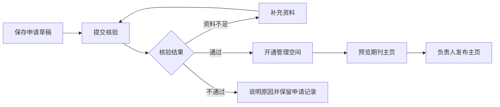
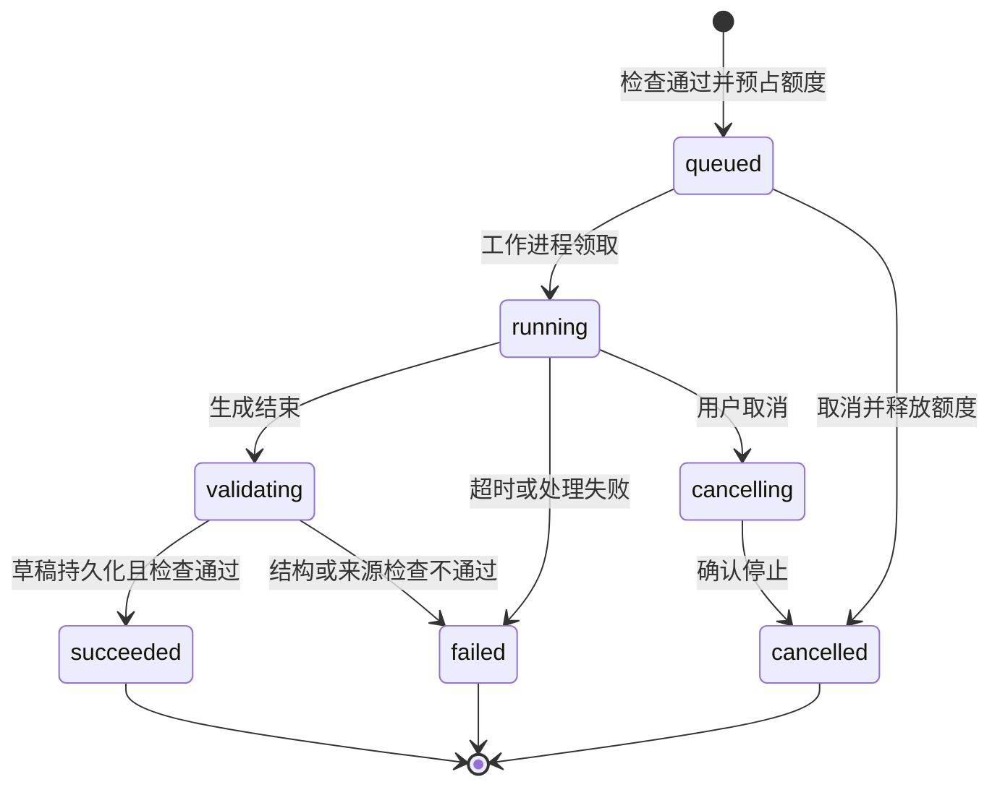

# OpenScience 期刊入驻与论文 AI 化

## 产品需求文档 PRD v1.0

> 本文件保留需求设计时的范围与待验收声明。开发交付状态见 [期刊实施交接](../handoff/2026-09-15-journal-onboarding-handoff.md)。

| 项目 | 内容 |
|---|---|
| 日期 | 2026-09-15 |
| 文档状态 | 需求设计稿，可用于产品评审、技术拆解和排期 |
| 产品目标 | 期刊在 OpenScience 建立官方主页，集中组织已发表论文，通过结构化解读与证据关联改善研究的发现、理解和引用 |
| 商业方向 | 基础入驻免费；AI 标准解读、批量导入与材料整理、持续运营；当前不提供专业审核付费选项 |
| 首期用户 | 3–5 家共建期刊及其编辑部 |
| 本次交付范围 | 产品需求、页面结构、业务规则、权限、数据关系、版本与配额流程、验收标准；未进行网站开发或上线 |
| 事实依据 | 复用本对话已核验的官网、公开研究对象、开发者文档，以及前两份 OpenScience 方案 |

> **首期要跑通的完整流程：编辑部申请入驻 → 平台核验 → 建立主页 → 导入论文 → 获取可用来源 → 生成 AI 解读草稿 → 编辑审核 → 发布固定版本 → 读者与工具访问 → 期刊查看基础使用数据。**

## 0. 产品决策摘要

### 0.1 本稿采用的默认决策

以下为设计默认值，便于开发拆解；用户尚未逐项确认的商业参数在第 17 节列出。

1. **免费申请、免费基础主页。** 通过身份核验的期刊可建立主页和维护论文目录。
2. **首期服务已发表论文。** OpenScience 提供论文关联页与 AI 解读对象；原出版者、原作者、原文 DOI 和出版状态保持清楚。
3. **每刊一个管理空间。** 期刊成员只能访问本刊授权内容；用户可以加入多刊，但必须主动切换工作空间。
4. **复用现有 Research Object。** 不建立另一套与现有六字段、证据、版本和 API 相互脱节的论文系统。
5. **目录记录与 AI 解读分别发布。** 可以先展示经核对的论文书目信息；AI 草稿经过审核后再公开。
6. **正文不足时不生成完整解读。** 只有摘要时明确标为“摘要解读”，不输出虚构图卡、完整方法或复现结论。
7. **AI 不自动公开发布。** 首期由具备发布权限的编辑确认具体版本。
8. **首期付费采用服务开通。** 可查看额度、申请服务，由平台依据确认的订单开通；在线支付和自动续费后续建设。
9. **基础阅读与固定版本不按订阅期限关闭。** 付费到期影响新增付费作业；内容是否可公开由授权和内容状态决定。
10. **AI 外部引用监测在第二阶段交付。** 首期显示真实站内与 API 使用数据，不展示推算的 AI 引用增长。

### 0.2 现有能力与待开发能力

| 类型 | 能力 |
|---|---|
| 已在公开页面看见 | 研究对象、六字段、主张与证据、署名、许可、固定版本、公开历史、概念图 |
| 已在公开文档看见 | 公开对象 JSON、最新/固定版本接口、OpenAPI、附件访问范围及状态说明 |
| 本期需要新增 | 期刊目录与主页、入驻核验、成员权限、论文归属、批量导入、期刊加工队列、审核发布、额度、基础统计、平台管理 |
| 实施前需要代码核对 | 身份认证、后台角色、对象所有权、存储与队列、计费、审核及公开缓存机制的实际实现 |

本稿未读取生产代码或数据库。下文的数据对象、路由和接口是逻辑设计，不能视为现有表结构或已上线端点。

## 1. 用户、问题与产品目标

### 1.1 核心用户

| 用户 | 主要问题 | 产品需要帮助其完成的任务 |
|---|---|---|
| 期刊负责人 | 如何低成本建立 AI 传播入口，并明确投入价值？ | 入驻、管理团队、安排预算、查看进度和结果 |
| 期刊编辑 | 论文多、逐篇整理耗时、生成内容需要核对 | 批量导入、处理缺失来源、审核和更新 |
| 作者 | 贡献是否被准确理解和归属？ | 查看对应解读、反馈错误、提供获准公开的材料 |
| 读者 | 如何迅速判断研究内容、依据和适用范围？ | 浏览期刊、筛选论文、阅读解读、回到原文 |
| AI/研究工具 | 如何读取可信、可追溯的公开内容？ | 获取公开论文列表、固定版本、来源与许可 |
| 平台运营 | 如何核验期刊、控制质量与加工成本？ | 核验入驻、处理争议、管理服务与异常 |

### 1.2 产品目标

- 让期刊可以持续维护一个品牌清楚、论文有序的公开主页。
- 将论文目录、六字段、图卡、主张证据与版本组织成可复用对象。
- 降低编辑批量整理和检查的成本，同时明确审核责任。
- 建立免费使用到付费加工的自然转化路径。
- 记录实际交付、访问和后续引用观测，为服务效果提供依据。

### 1.3 首期范围

| 优先级 | 本期内容 |
|---|---|
| P0，首期必须 | 申请核验、期刊主页、成员角色、DOI 批量导入、逐篇材料补充、AI 标准包、审核发布、固定版本与公开 API、额度与服务申请、基本统计、纠错与撤回状态 |
| P1，第二阶段 | 大规模历史回溯、CSV/XML 集成导入、作者结构化核对、完整 Topic Hub、外部 AI 监测与报告 |
| P2，后续 | 多刊出版社工作台、跨刊知识图谱、自动支付、定制域名、正式出版托管、标准化 AI Readiness 外部评估 |

首期不包含投稿审稿系统、录用决策、DOI 注册、改变原 DOI 解析、完整出版流程迁移、AI 训练内容交易或付费排名。这些功能如有需求应分别立项。

## 2. 信息架构与页面

### 2.1 入口与导航

主导航增加“期刊”。普通读者看到期刊目录；已登录编辑在研究桌面增加“个人研究 / 我的期刊”切换。不要把个人工作空间的内容自动展示到期刊。

| 页面 | 建议路由 | 主要用户 | 核心内容 |
|---|---|---|---|
| 期刊目录 | `/journals` | 所有人 | 搜索、学科、期刊卡片、申请入驻 |
| 入驻介绍 | `/journals/join` | 编辑部 | 价值说明、免费与专业服务边界、申请入口 |
| 入驻申请/状态 | `/journals/apply` | 申请人 | 分步表单、草稿、提交与补件状态 |
| 期刊主页 | `/journals/{slug}` | 所有人 | 品牌、简介、论文、主题、公开说明 |
| 期刊工作台 | `/dashboard/journals/{journalId}` | 成员 | 待办、论文、作业、团队、额度、统计 |
| 论文批量导入 | 工作台下 `/imports` | 编辑 | DOI 导入、预览、归属检查、逐项结果 |
| AI 作业 | 工作台下 `/jobs` | 编辑 | 队列、缺失材料、失败原因、额度 |
| 论文审核 | 工作台下 `/articles/{articleId}` | 编辑/发布人 | 原文与解读对照、修改、审核、发布 |
| 团队和服务 | 工作台下 `/settings`、`/services` | 负责人/管理员 | 邀请、权限、配额、服务申请 |
| 平台管理 | `/admin/journals` | 平台运营 | 入驻核验、冲突、冻结、订单和审计 |
| 论文公开阅读 | 复用 `/research/{publicId}/v/{versionNo}` | 所有人 | 期刊归属、研究要点、原文、证据和版本 |

已存在的公开研究链接继续有效。期刊主页的论文卡片进入同一研究对象；不为同一版本复制多个相互独立的阅读地址。

### 2.2 期刊主页草图

```text
[期刊 Logo] 期刊名称                       [编辑部身份已核验]
简介 / 学科 / ISSN / 出版单位              [访问原官网]

[论文]  [主题]  [关于期刊]

在本刊论文中搜索……   年份 ▾   类型 ▾   解读状态 ▾

论文卡片
  原题名 · 原作者 · 原发表日期 · DOI
  一句话研究说明（已经审核时显示）
  [已有 AI 解读 / 书目信息]
  [阅读解读] [查看原文]

页尾：原出版信息 / 联系编辑部 / 内容纠错 / 平台说明
```

“编辑部身份已核验”仅表达管理方身份。不要使用容易误解为论文质量保证的“官方认证期刊”“AI 认证优秀期刊”。平台付费状态不影响公开检索排序。

### 2.3 工作台草图

```text
当前期刊 ▾     [导入论文] [申请专业服务]

待补材料  需审核  已发布解读  本期额度

论文列表
题名 | 原文来源 | 处理状态 | 审核状态 | 公开版本 | 操作

批量操作：补充材料 / 生成解读 / 导出
近期动态：作业完成、退回修改、版本发布、来源状态更新
```

计数点击后进入对应列表。空白页显示一个明确的下一步：例如“导入第一篇论文”。错误提示使用“缺少可读取全文”“需要核对所属期刊”等可操作语言。

## 3. 角色与权限

### 3.1 期刊内角色

| 操作 | 负责人 Owner | 管理员 Admin | 编辑 Editor | 审核人 Reviewer | 普通作者/读者 |
|---|---|---|---|---|---|
| 编辑期刊资料 | 是 | 是 | 否 | 否 | 否 |
| 管理成员 | 是 | 可管理编辑/审核人 | 否 | 否 | 否 |
| 转移负责人、变更主体 | 是，须复核 | 否 | 否 | 否 | 否 |
| 导入本刊论文、维护草稿 | 是 | 是 | 是 | 否 | 否 |
| 发起 AI 加工 | 是 | 是 | 按额度权限 | 否 | 否 |
| 查看未公开内容 | 本刊全部 | 本刊全部 | 本刊已授权内容 | 仅分配审核内容 | 否 |
| 审核并退回 | 是 | 是 | 仅获授发布权限时 | 分配范围 | 否 |
| 公开发布/更正 | 是 | 是 | 须另授发布权限 | 否 | 否 |
| 查看/申请专业服务 | 是 | 是 | 看剩余额度；不能改套餐 | 否 | 否 |
| 反馈内容错误 | 是 | 是 | 是 | 是 | 是 |

首期角色支持叠加。小编辑部可由同一管理员加工与发布，但系统必须记录真实审核人，不把自审标成独立审核。专业人工审核作为单独服务时，应分配不同审核人。

### 3.2 关键约束

- 每刊始终至少有一位负责人；不能直接移除最后负责人。
- 邀请链接绑定期刊、角色和受邀邮箱，7 天有效、单次使用；未登录或邮箱不匹配时不能接管成员身份。
- 管理员不能提升自己为负责人，也不能授予超出自己范围的权限。
- 附加的额度使用权和发布权只能由负责人或获授权管理员授予，记录期刊/文章范围、单次或周期额度上限、有效期以及授予人。角色权限按并集合并，但不能越过内容状态、明确范围限制或平台暂停状态。
- 成员移除、角色降级、期刊暂停必须在下一次受保护操作时生效；旧会话和后台作业都重新核验权限。
- 成员失权后，其尚未接受且依赖该权限的邀请失效；受保护文件下载也重新鉴权。临时链接须可撤销或有足够短的有效期，不能绕过最新权限持续访问。
- 平台服务编辑仅获得被分配的期刊/文章范围和有效期，无权默认浏览所有私有草稿。
- 用户提交的 `journalId` 只是定位参数。服务端按登录身份和成员关系检查所有读取、编辑、附件下载、导出、作业与发布。
- 平台管理员的例外访问需记录理由与操作；不在公开 API 返回私人联系方式、申请材料或审核备注。

## 4. 期刊入驻与核验

### JRN-01：申请表

| 字段 | 要求 | 公开性 |
|---|---|---|
| 英文/中文刊名 | 英文刊名必填并作为管理与展示主名称；中文刊名选填 | 公开 |
| eISSN / pISSN | 至少一个；没有时进入人工特殊审核，不能虚构 | 核验后公开 |
| 原官网 | 必填，填写可确认的期刊页面 | 公开 |
| 主办/出版单位 | 出版商必填，主办单位可选；均填写官方英文名称 | 公开 |
| 学科、简介、Logo | 学科、简介用英文填写；Logo 可稍后补齐 | 公开 |
| 申请人姓名、职务、邮箱 | 姓名用罗马字母拼写、职务用英语；验证当前账号邮箱 | 默认不公开 |
| 代表编辑部的依据 | 用英文说明代表资格，可附单位邮箱、官网或授权材料的来源线索 | 私有 |
| 计划导入数量、希望服务 | 用于容量与运营安排 | 私有 |
| 内容使用声明 | 分别声明目录展示、文件处理、附件公开的授权范围 | 记录版本，不向访客显示证明材料 |

支持保存草稿、返回修改和提交预览。原单位邮箱是身份线索，不作为唯一证明；最终由平台核验可代表该期刊的人或单位。

2026-09-16 用户修订：除选填中文刊名外，期刊与申请人文字元数据统一使用英文。前端和域层校验英文字符，兼容罗马字母人名的重音符号；官方名称与英文语义由平台管理员核验。旧数据不自动翻译。审核仍仅由 `platform_admin` 人工执行，不自动通过，不自动授予申请人管理员权限。

服务可选项仅保留：AI 标准解读包（从获准来源生成摘要、结构化解读、证据主张、FAQ 和有依据的图卡）、批量导入与材料整理（书目、文件、授权记录匹配入库）、持续运营与基础统计。取消专业审核服务不取消公开前的期刊编辑确认。

提交成功跳转 `/journals/apply/{applicationId}`，以真实数据库申请 UUID 作为申请编号，显示期刊、状态、提交时间和审核说明。回执沿用本人所有权接口，匿名用户先登录；“我的申请”可重开回执，补件后沿用同一申请编号。

### JRN-02：核验流程



平台核对刊名、ISSN、原官网、管理主体和申请人权限。核验不等于内容再传播许可，后者按文章和文件分别记录。

### JRN-03：重复与冲突

- 同一 ISSN 已存在：显示已有期刊并提供“申请加入/管理权申诉”，不再开一个相同主页。
- pISSN 与 eISSN 视为同一期刊的标识集合；改名、续刊、合刊等情况人工处理并记录关系。
- 同名但不同 ISSN 不自动合并；缺 ISSN 的期刊不能仅靠刊名自动批准。
- 有争议时保持已有公开内容和管理关系，暂停新增的冲突授权，交平台处理，不自动转移控制权。
- 管理主体变更要求重新核验；普通简介修改无需重复入驻。
- 负责人转移、出版/管理主体变化或身份申诉成立触发重新核验；域名/单位邮箱失效形成复核工单，由平台确认是否影响身份。复核中的冲突主体暂停成员扩权和新增公开发布，平台保留紧急纠错与撤回通道。

### JRN-04：期刊状态

申请状态：`draft → submitted → needs_information / approved / rejected`。

- 管理员操作明确为“通过入驻 / 退回修改 / 拒绝入驻”。资料不全或需要英文修正使用退回修改，状态显示“待修改”。
- 申请人在“我的申请”或回执点击“继续修改”，编辑同一申请；“保存修改”保持待修改，“重新提交”才回到待平台审核。编号、资料与历史审核事件保留，不自动还原草稿，也不要求撤回或重建申请。
- 拒绝入驻必须填写原因并二次确认，结束本轮申请且锁定申请人编辑。
- 管理员误拒后可填写更正原因，使用“更正为退回修改”。仅允许 `rejected → needs_information`，核对当前修订号；原审核意见保留，更正前状态/审核者/时间/原因及修订号与更正事件同事务记录。不能直接把拒绝改为通过。

开通后状态：`setup → active → paused / closed`。

- `setup`：工作台可准备，主页尚未公开。
- `active`：可展示和进行授权操作。
- `paused`：禁止新增作业及发布。主页保留状态说明；已公开合法论文不自动删除，涉争议内容单独处理。
- `closed`：停止运营，保留允许保存的公共记录、来源和版本；可由平台按恢复流程重新核验。

暂停、关闭与套餐到期是三种不同事件，不共用一个状态字段。

暂停或关闭后冻结新增发布及 `latest` 指针推进，独立个人对象不受其所有权影响。源内容的重要纠错由平台核验后走有记录的例外流程；撤回或访问收紧可以立即执行。合法既有固定版本保持可访问；下线的版本返回允许公开的身份、原因、时间与替代入口，不静默改写成其他内容。

## 5. 论文导入、归属与来源

### ART-01：首期导入方式

1. 输入一个 DOI。
2. 粘贴 DOI 列表，默认每批最多 50 条，可后台配置。
3. 无 DOI 时手工填写原题名、作者、原发表日期、刊名及稳定原文地址，进入人工核对。
4. 将已存在的个人研究对象申请关联到期刊，按 ART-04 处理。

来源文件由编辑逐篇补充；第二阶段再支持大批量文件映射与 CSV/XML 接入。支持 Crossref 等合法来源获取书目元数据，元数据获取成功不代表全文可用或有权公开全文。[Crossref API](https://www.crossref.org/documentation/retrieve-metadata/rest-api/)

### ART-02：预览与逐项结果

导入先预览，再由编辑确认。每条显示：识别的 DOI、题名、作者、原期刊、日期、匹配状态、是否已存在、可用来源。

| 结果 | 处理 |
|---|---|
| 与已核验 ISSN 匹配 | 可确认加入本刊目录 |
| 期刊信息缺失/名称不同 | 要求补证；未核对前不能以本刊正式论文发布 |
| 明确属于其他期刊 | 不允许占用为本刊论文；后续可作为专题相关研究引用 |
| 已在本刊目录 | 返回既有条目；不重复建对象或重复计费 |
| 已有个人解读 | 提供关联/复用申请，不能自动收走个人对象 |
| 元数据服务失败 | 单项失败、保留输入、允许稍后重试 |
| 无法识别标识 | 编辑修正输入；不依据相似标题强行匹配 |

DOI 去除常见 URL/前缀形式后按规范化键去重，保留原始输入。并发提交同一 DOI 时由数据唯一约束保证结果一致，不能仅依赖前端去重。

### ART-03：书目、期刊收录关系与 AI 对象

```text
Work：原始论文身份（DOI 或经核验的其他标识）
  ├─ JournalArticle：属于哪一期刊、刊内展示信息
  ├─ ResearchObject：现有个人解读，可独立存在
  └─ ResearchObject：期刊管理的解读对象
        └─ PublishedVersion：公开的具体解读版本
```

默认同一正式论文只认一个原发表期刊。合作转载或历史归属变更人工核验，不因某编辑导入而改变原始归属。每项 Work 在同一期刊只能有一条有效目录记录和一个有效的期刊管理解读对象；个人笔记可独立存在。

规范化 DOI 在全平台只对应一项 Work。Work 是共享的原始身份记录，不由某一期刊或个人账号占有。导入与认领不改写其原刊、原作者或 DOI；需要更正时保存来源证据和字段变更记录，由平台核验。原文更正、撤回通知和不同作品版本通过关系表达，不靠标题相似度合并。

原文 DOI、平台对象标识、解读版本号是不同身份。原作者排列和姓名保留；编辑姓名记录为加工/审核贡献，不替换论文作者。

### ART-04：已有个人对象关联

- 期刊可引用已经公开且允许使用的对象，并明确“作者/用户解读”状态；未获管理授权不能贴上“编辑部核验解读”。
- 需由期刊管理时，向对象所有者发起明确的关联或内容复制授权；记录范围和同意版本。首期可由平台人工协助留存，不构建复杂转移系统。
- 复制获准内容形成期刊对象时，保留原对象链接、贡献和来源；个人原对象的版本、所有权与公开状态保持独立。
- 不允许通过“认领 DOI”获取该 DOI 下他人的未公开草稿、文件或私有信息。
- 授权记录绑定授权人、对象具体版本、允许关联/复制/改编/AI 处理/公开的动作、附件范围和有效条件，未选范围默认不授权。授权结束或发生争议后停止不再获准的新操作；既有公开内容按其具体许可和核验结果处理，不根据个人对象当前状态自动同步删除或开放。

### ART-05：来源分级与处理权限

| 来源条件 | 可执行工作 | 公开呈现 |
|---|---|---|
| 仅有书目信息 | 核对目录、保留原文入口 | “书目信息”，不展示 AI 结论 |
| 有摘要且允许处理 | 生成摘要范围内说明 | “基于摘要的解读”，六字段中缺失项明确标注 |
| 有可处理的完整正文 | 生成完整六字段、主张与 FAQ 草稿 | 审核后标明全文依据 |
| 有图表和补充材料 | 增加图卡、参数与复现入口 | 按具体素材许可展示 |

来源记录包括获取方式、获取日期、内容哈希、版本、范围及处理/公开许可。一个 PDF 可允许内部加工而不允许公开下载；这两项权限必须分开。

至少分别记录“内部处理”“生成衍生说明”“公开原文件/图片”“公开衍生说明”的依据与适用许可。可访问网页、取得元数据或获得一个材料许可，均不自动覆盖全部动作。发布时再次核对来源版本与许可；权利未明确时仅保留获准的书目和原文入口。公开对象、图卡与 API 展示适用许可，不继承与素材不相符的默认标签。

来源受限时不尝试绕过访问控制。允许上传获准材料或记录原文地址；可处理内容不足时保持待补充状态。

## 6. AI 加工与人工审核

### AI-01：标准加工包

| 内容 | 首期默认输出 | 必要质量要求 |
|---|---|---|
| 一句话摘要 | 1 条 | 不超出文章贡献和证据成熟度 |
| 短摘要 | 约 150–300 中文字或 80–120 英文词 | 与原文一致，标明理论/模拟/实验 |
| 六字段 | problem、insight、method、results、limitations、reproducibility | 缺失时明确标注，不补写不存在的结果 |
| 关键主张 | 最多 5 条，按内容实际生成 | 每条有来源定位、证据类型、条件与局限 |
| 图卡 | 最多 5 张核心图/表 | 图号、面板、单位、目的、结果、边界对应正确 |
| FAQ | 最多 5 个 | 回答有依据；无法回答时说明原文未提供 |
| 术语 | 最多 15 项 | 统一缩写及中英文表达 |

数量是标准包上限，不是强制凑数要求。文献综述、理论论文、实验论文采用相应提取规则。视频生成、动态图、独立复现实验不在首期标准包内。

### AI-02：发起作业

编辑选择论文 → 系统检查身份、论文状态、来源与额度 → 显示本次范围及预计消耗 → 编辑确认 → 作业入队。

批量发起时，先显示可执行、需补材料、已存在作业、额度不足四类结果；编辑可以只提交可执行项。不能因为一个条目失败而隐藏其他条目的结果。

稿件输入视为待分析材料。文件或网页中的指令不得改变权限、提交外部请求、调用无关工具或决定发布状态。

### AI-03：作业状态



- `succeeded` 仅表示可供审核的草稿已生成，不表示文章已公开或科学结论已独立验证。
- 来源缺失在入队前拦截；处理中失效则失败并给出修复建议。
- 自动技术重试属于同一个逻辑作业，最多 2 次；用同一预占与结算记录，不重复计费。
- 运行中取消采用可确定的终态：取消先提交则草稿不成为可用交付、释放额度；成功先提交则保留交付并显示已经完成。不能出现既扣费又无交付且无说明的状态。
- 终态不随重复请求改变。失败后用户点击“重试”创建关联的新尝试并重新预占；原尝试仍为失败且未消耗。用原幂等键重放只返回原结果，成功的后继尝试最多结算一次。
- 期刊暂停、成员失权或文件许可变更时，中止尚未提交的结果。提交结果之前再次检查；已完成草稿的保留与可见范围按内容权限处理。
- 进程崩溃后可恢复作业；超时预占由对账任务处理，仍在运行的作业不能被误释放。

### AI-04：审核界面

桌面采用左右对照：左侧原文与定位，右侧结构化解读；移动端改为“原文/解读”切换。

编辑可逐项修改、退回重做、标记未提供、调整证据链接。图卡保留原图出处；不能仅凭生成图替代原始科学图证。

发布前必须确认：

1. 题名、作者、期刊与原文 DOI 正确。
2. 关键数字、单位、实验/模拟/理论类别与原文一致。
3. 关键主张有可访问的依据定位；来源失效时先处理。
4. 局限和复现字段没有虚构内容。
5. 公开文本、图、附件分别符合记录的许可范围。

审核操作绑定草稿修订号和来源快照。审核后正文、图卡、来源、许可或主张发生变化，自动取消该草稿的发布放行状态，要求重新核对。仅修改期刊列表排序等展示配置不触发论文内容复审。

### AI-05：审核后的再生成

- 再生成结果保存为新草稿，不覆盖已公开版本或编辑正在修改的内容。
- 若生成期间草稿被编辑修改，返回“存在新修改，请比较后合并”，不得自动覆盖。
- 编辑可选择保留原段落或采用生成段落；系统记录来源版本和加工记录。
- 首期因新要求主动发起新作业会显示其额度消耗；失败作业重试不重复消耗。人工编辑与公开新版本本身不收 AI 生成额度。

## 7. 发布、引用与更新

### PUB-01：两类公开状态

**目录记录状态：** `draft → verified → listed → archived`。只有经核对归属及必要展示权限的书目信息可进入 `listed`。

**AI 解读草稿状态：** `draft → in_review → changes_requested / approved → published`。退回后可继续修改与复审；已发布后再编辑产生新草稿。

**内容访问状态：** `public / restricted / withdrawn`；独立于草稿状态和商业套餐。

同一论文可以同时存在“公开 v1”和“未发布 v2 草稿”。主页和公开 API 只使用允许公开的版本，不读取工作草稿。

### PUB-02：公开页面与引用

- 顶部显示原论文题名、作者、原刊名、原发表日期、DOI 和“查看原文”。
- 平台解读显示独立的发布/更新日期，不能把原论文发表日期改成入驻日期。
- 显示解读依据范围和审核责任，例如“基于全文，由编辑部核对”“基于摘要的解读”。
- 默认复制科学来源的原文引用；另提供“引用此解读版本”，包含固定版本地址与加工贡献。
- “编辑部核对”不写成“已完成同行评议”。正式论文自身的同行评议状态以原出版信息为依据。
- 图卡、FAQ、相关资源均能回到对应原文或材料。

### PUB-03：原子发布

一次发布绑定：草稿修订号、来源快照、审核结果、文件权限与发布人。服务端检查这些对象仍有效后，一次性提交固定版本及公开指针。

重复点击、网络超时后重试不能创建两个相同公开版本。旧版本内容不被新草稿覆盖；旧链接可继续指向其原版本，但受撤回和权限状态约束。

发布事件触发期刊列表、公开 API、站内索引、站点地图和缓存更新。局部更新失败有重试与告警；不能通过私有草稿临时拼出“新版本”。

### PUB-04：更正与撤回

| 事件 | 处理 |
|---|---|
| 解读措辞/数值更正 | 新草稿、重新审核、发布新版本，附变更说明 |
| 原文出现更正/撤回通知 | 平台或编辑核验通知，更新来源状态，标记受影响解读与主张 |
| 附件失去公开权限 | 立即禁止匿名下载，撤销签名链接/缓存；记录替代获取方式 |
| 解读整体撤回或受限 | 正文、图卡、FAQ、附件及结构化副本不再公开，只保留允许公开的身份和状态 |
| 用户反馈 | 创建工单，编辑可回应、修订或说明未采纳原因；未审核反馈不直接公开 |

撤回/受限优先于缓存和索引：源站鉴权立即阻断内容；已托管公开缓存应在 5 分钟内失效并可监控重试，内部搜索与后续主题引用同步清理。已被外部独立保存的副本只能通知更新，不能承诺平台能够回收全部副本。

期刊关闭不自动撤回其全部论文。必须区分停止服务、编辑部身份争议和具体内容授权失效，并按对象处理。

## 8. 免费、试用、专业服务与额度

### BIZ-01：首期服务分层

| 能力 | 免费基础 | AI 标准加工 | 专业运营（逐步上线） |
|---|---|---|---|
| 核验、主页、目录、原文链接 | 包含 | 包含 | 包含 |
| 编辑自助填写与审核发布 | 包含 | 包含 | 包含 |
| 公开对象读取与固定版本 | 合理用量内包含 | 包含 | 包含 |
| 批量生成摘要/六字段/图卡/FAQ | 限量体验 | 按额度 | 按年度约定 |
| 领域编辑代审核 | 不包含 | 单独购买 | 套餐约定 |
| 完整主题页与外部监测 | 后续可申请 | 单独购买 | 套餐约定 |
| 专属支持、平台集成 | 不包含 | 按需 | 套餐约定 |

后台权限与计费权益分开。购买套餐不授予论文所有权、成员权限或未经审核发布权；额度不足也不能剥夺已拥有的自助编辑权限。

### BIZ-02：推荐的试用与容量默认值

这些数值是首期建议配置，实施时统一从配置表读取，不写死在页面中。

| 参数 | 建议初值 | 处理方式 |
|---|---:|---|
| 每刊首次 AI 体验额度 | 5 篇标准包 | 入驻核验通过后单次发放；90 天内可用 |
| 同刊再次申请 | 不重复赠送 | 以已核验期刊主体和历史发放记录判断 |
| 每批 DOI 导入 | 50 条 | 超限提示拆批；后台可调整 |
| 初期目录容量 | 1,000 条/刊 | 达限可申请扩容；不自动收费 |
| 免费文件存储 | 2 GB/刊 | 达限后限制新增附件，不删除既有公开内容 |
| 单文件大小 | 50 MB | 超限提示人工材料接入，且实际值需经存储评估 |
| AI 同时运行 | 2 个/刊 | 其余排队；平台另设全局上限 |
| 标准包图表上限 | 5 张 | 超范围提示分配核心图或申请扩展加工 |

基础使用免费是产品方向；长期保存责任、超额支持和服务退出安排需要在公开政策中明确。

### BIZ-03：额度账本

额度分别记录发放、预占、消耗、释放、到期和人工调整，不只保存一个可随意覆盖的余额数字。

```text
可用额度 = 对当前未到期的额度批次求和
           （该批发放与净调整 − 已消耗 − 未结算预占）

已到期批次的在途预占单独展示，不从其他有效批次重复扣减。

用户确认作业
   → 同一事务内检查可用额度并预占
   → 生成并校验草稿
   → 可用草稿持久化成功：预占转消耗
   → 失败或取消：释放预占
```

- **计费交付点：** 合格的待审核草稿可被客户打开时计 1 次标准作业。计费不等待公开发布，也不表示已购买专业人工审核。
- 服务端的格式/来源校验不通过，或系统故障导致无法交付草稿，不扣额度。
- 作业、草稿交付和账本结算使用同一逻辑作业键；并发请求和重复回调最多消耗一次。
- 两个并发作业争用最后 1 个额度时，最多一个成功预占；另一项明确返回额度不足。
- 预占绑定具体额度批次，优先使用最早到期批次；平台调减额度不能使该批可用值为负，已有预占和消耗不能被静默覆盖。
- 已有效预占的作业在额度有效期结束后仍可按原预占结算；到期额度被释放后不会重新变成可用余额。
- 平台人工补偿必须填写原因并写入新账本记录，不修改历史记录。确认由产品错误导致的无效草稿可补偿额度。
- 发起作业前显示预计消耗，正常技术重试不再次确认收费；用户主动选择新的加工范围则作为新作业明确确认。

### BIZ-04：服务申请与开通

```text
编辑部查看套餐与剩余额度
  → 选择预计年发文量、语言、图表规模、服务需求
  → 提交服务申请
  → 平台确认范围与报价
  → 合同/订单确认
  → 平台记录开通依据、额度、有效期
  → 工作台显示已开通服务与消费记录
```

首期网站不自动扣款、不自动续费。若未定正式价格，显示“申请服务方案”，不展示虚构原价或折扣。到期后保留读取、导出、自助编辑及已公开版本，只限制新增付费加工或已到期的专属服务。

## 9. AI 可读入口与基础统计

### DISC-01：公开内容结构

- 期刊与论文核心文本可从首个公开 HTML 响应读取，关键事实不依赖登录或仅存在于客户端交互后的页面。
- JSON-LD 与页面显示内容一致，论文身份、原出版信息及平台解读关系清楚。
- 原文 DOI 和平台解读分别有正确的身份标识；独立解读不一律设置为原文镜像。
- 站点地图只收录可公开页面；草稿、核验材料、审核备注和受限内容不进入公开索引。
- 公开图像带文字说明；公式、单位和表格在可读文本中保留语义。
- 暂未公开的期刊和论文不进入公共目录；空页状态正常显示，不伪造样例论文填充生产数据。

Google 官方指南强调可抓取、可索引、内容一致等基础条件，并未要求专门的 AI 标记；满足条件也不保证被收录或引用。本产品不设置“打开开关即可被所有 AI 引用”的功能承诺。[Google AI 搜索指南](https://developers.google.com/search/docs/appearance/ai-features)

### API-01：首期公开 API

在已有固定版本研究 API 之上新增期刊发现层。以下为拟议端点，实际实现需与现有 OpenAPI 对齐：

```http
GET /api/journals?cursor=...&limit=20
GET /api/journals/{journalId}
GET /api/journals/{journalId}/articles?cursor=...&limit=20

# 复用已公开文档中的对象端点
GET /api/research/{publicId}
GET /api/research/{publicId}/v/{versionNo}
```

目录响应至少包含期刊身份、原官网、ISSN、状态和公开论文数量。文章列表包含原文身份、目录状态、可公开解读类型及固定版/最新版链接；只有书目时解读链接为空。

分页默认 20、最大 100，使用稳定排序和游标。返回限流状态与重试提示。公开 API 不返回内部存储路径、申请人邮箱、内部任务提示词或私有文件 URL。

未公开内容对匿名调用返回不存在；已公开后撤回/受限的对象沿用现有接口的身份与空正文策略，明确状态，不让调用方把空值当成完整研究。无可匿名下载权限的附件不提供下载链接。

### MET-01：首期工作台指标

| 指标 | 口径 | 用途 |
|---|---|---|
| 已收录论文 | 当前本刊有效公开书目数 | 看目录建设进度 |
| 已发布解读 | 至少有一个有效公开解读版本的论文数 | 看交付进度，按论文去重 |
| 待审核/待补来源 | 对应业务状态的论文数 | 编辑待办 |
| 成功作业率 | 有效逻辑作业成功数 / 已结束的有效逻辑作业数，取消单列 | 看处理质量；重试不重复计算 |
| 处理周期 | 入队到草稿可用的中位数和 P95 | 看加工效率 |
| 页面访问 | 可用日志中剔除已知自动请求后的访问；方法公开 | 看传播入口使用 |
| 原文点击 | 阅读页点击原文入口的事件数 | 看转介，不等于原文实际阅读完成 |
| API 请求 | 有效公开读取次数、状态和客户端分类 | 看接口使用；未知客户端不标作 AI |
| 额度使用 | 可用、预占、消耗、到期 | 看服务成本与余量 |

没有数据时显示“暂无数据”，不能显示模拟曲线或伪造增长百分比。内部预览、管理员测试、监测机器人与真人流量分别标记。避免用 API 请求量作为“AI 引用次数”。

### MET-02：第二阶段外部监测

增加独立问题集、平台与模型标识、语言、日期、重复运行、回答快照、来源归一化及引用支持核对。按此前服务方案区分原文来源、平台解读来源、无链接提及与技术失败。

报告必须给出样本量及分母，不对所有互联网 AI 使用情况做总体推断。专业服务已购买但平台自动化尚未上线时，可通过人工测量交付真实报告并标注方式。

## 10. 数据关系与接口约束

### 10.1 逻辑数据对象

这些是实现需要表达的信息，不要求照此创建同名数据库表。

| 对象 | 关键字段/关系 | 约束 |
|---|---|---|
| JournalApplication | 申请人、刊名、ISSN 集合、主体、依据、状态、审核记录 | 私有材料隔离；重复申请关联既有期刊 |
| Journal | 稳定 ID、slug、名称、标识集合、官网、主体、核验及运营状态 | 稳定 ID 不变；slug 改动保留重定向 |
| JournalMembership | journalId、userId、角色、范围、状态、有效期 | 一用户一刊的有效关系唯一；至少一位负责人 |
| JournalInvitation | 受邀邮箱、角色范围、邀请人、到期、状态 | 单次使用；权限不能高于发起人 |
| Work | 原始标识、原作者、原刊、原日期、来源与出版状态 | 规范化 DOI 全局唯一；缺 DOI 不用标题当唯一键 |
| JournalArticle | journalId、workId、卷期/主题、目录状态、officialObjectId | 有效的 journalId + workId 唯一 |
| ResearchObject / Version | 沿用现有对象、六字段、主张、证据、作者/编辑贡献、版本 | 个人/期刊管理范围明确，旧链接兼容 |
| SourceSnapshot | 来源地址/附件、哈希、范围、时间、版本 | 每次加工绑定具体来源 |
| RightsRecord | 来源/对象版本、动作许可、证明、有效条件、审核人 | 公开文件与内部处理分开 |
| ImportBatch / ImportItem | 发起人、期刊、逐条输入、结果、关联记录 | 部分成功可继续，不重复创建 |
| AIJob | 期刊、文章、请求键、来源快照、范围、状态、尝试与结果 | 同一逻辑请求不重复入队/计费 |
| ReviewRecord | 修订号、审核人、结论、核验项、时间 | 内容修订使旧放行失效 |
| Entitlement / Ledger | 套餐、有效期、额度发放/预占/消耗/释放 | 不可重复结算，有可追溯账本 |
| ServiceRequest | 需求、报价/订单依据、开通人与权益 | 商务状态不改变内容所有权 |
| AuditEvent | 操作者、期刊、对象、动作、时间、理由、前后状态 | 包含权限、发布、额度和平台例外操作 |
| UsageEvent / Report | 公开对象、事件类型、时间、客户端分类、统计口径 | 不记录不必要的个人资料，不泄露未公开题名 |

### 10.2 内部操作契约

| 操作 | 请求需要包含 | 必须校验 | 重复/冲突处理 |
|---|---|---|---|
| 提交申请 | 申请修订号、材料、提交键 | 登录、必填、冲突 | 返回同一申请，不重复开空间 |
| 导入 DOI | journalId、输入列表、请求键 | 成员权限、归属、容量 | 返回逐项结果，同 DOI 指向同 Work |
| 创建作业 | articleIds、sourceVersion、范围、请求键 | 权限、来源、额度、状态 | 同键同请求返回原结果；同键不同参数拒绝 |
| 保存草稿 | draftRevision、内容 | 写入权限、修订冲突 | 冲突提示重新比较，禁止最后写入强覆盖 |
| 审核放行 | draftRevision、核验项、结论 | 审核范围、来源权限 | 针对精确修订记录 |
| 发布版本 | approvedRevision、请求键 | 发布权限、审核和内容仍有效 | 只提交一个固定版本 |
| 额度开通/调整 | 订单/补偿依据、权益范围、请求键 | 平台专属权限 | 追加唯一账本记录 |
| 访问收紧 | objectVersion、原因、时间 | 处置权限 | 优先更新公开状态并发出清理事件 |

内部错误建议区分：未登录、权限不足、对象不存在、归属冲突、版本冲突、来源不足、许可待确认、额度不足、限流和服务暂不可用。匿名请求不通过差异错误泄露私有对象是否存在。

### 10.3 历史数据接入

1. 先核对现有对象和版本模型，确认哪些字段可复用，避免重复设计同一内容。
2. 期刊关系以新增关联方式接入；已有个人对象默认保持原状。
3. 从一篇真实已发表论文完成“导入—来源—草稿—审核—页面—API”纵向验证，再扩大到批次。
4. 对已有 DOI 冲突先生成待核对清单；不批量按题名或作者相似度自动合并。
5. 新功能通过开关灰度启用；回滚时停止新期刊作业和入口，不破坏原个人研究与公开链接。

## 11. 非功能要求

### 11.1 可用性与可访问性

- 期刊主页和论文页适配桌面与手机；表格在小屏可横向滚动或改为卡片，操作按钮不溢出。
- 表单有明确标签、必填提示、逐项错误和键盘焦点；异步任务完成后可被辅助技术感知。
- 编辑离开页面后任务继续，重新进入能查看真实进度；保存失败时保留未提交内容并提示重试。
- 页面必须覆盖空、加载、部分成功、无权限、失败、暂停、撤回和额度不足状态。

### 11.2 性能与稳定性验收目标

| 项目 | 初始目标 | 测量条件 |
|---|---|---|
| 公开目录 API | P95 小于 1 秒 | 1,000 目录条目，20 条分页，约定测试环境，不含互联网传输 |
| 50 条 DOI 批次创建 | 3 秒内返回批次身份 | 元数据获取异步进行，不等全部结束才响应 |
| 页面核心内容 | 正文与身份首屏可读取 | 禁用客户端脚本仍有关键公开文本 |
| 发布与公开列表一致 | 1 分钟内反映新公开版本 | 故障有可重试事件与告警 |
| 访问收紧 | 源站即时生效，托管缓存 5 分钟内清理 | 用已缓存的旧 URL 验证；内部索引同步清理 |
| 作业恢复 | 中断后能够重新领取未终结作业 | 不重复交付与结算 |

这些是拟议验收目标，需用实际技术架构校准；当前未完成性能测试。首期先支持 3–5 刊，每刊上千条目录，运行并发以配置限制。

### 11.3 内容与租户隔离

文件上传限制类型、大小并校验实际内容；外部来源导入只访问获准公开 HTTP(S) 地址，阻止内网、回环、云元数据地址及重定向后的同类地址，避免把论文导入功能变成访问服务器内部资源的入口。

解析、生成和预览不执行原文脚本或嵌入指令。页面对富文本进行安全处理。私有附件、审核文件、服务报价与公开媒体使用独立权限检查和缓存策略。

后台服务账号按所需范围读取内容；日志不保存凭据、完整私有文件或不必要的个人联系方式。平台人工例外操作可追查。

## 12. 通知与运营处理

首期以站内通知和任务待办为主；邮箱邀请、申请结果通知可按现有通知能力接入。通知中的私有内容仍需登录后核验权限。

| 事件 | 通知对象 | 下一步 |
|---|---|---|
| 入驻需补件/通过/不通过 | 申请人 | 补充资料或进入主页设置 |
| 成员邀请 | 指定受邀人 | 验证身份并接受 |
| 批次部分失败 | 发起编辑 | 查看逐项原因 |
| AI 草稿完成 | 发起编辑/指定审核人 | 进入审核 |
| 审核退回 | 负责编辑 | 修改后重提 |
| 发布完成 | 发布人 | 查看固定版本和 API |
| 额度接近用完/到期 | 负责人/管理员 | 查看消费或申请服务 |
| 纠错/来源撤回 | 负责编辑与平台 | 核验并更新状态 |

同批任务汇总通知，避免一批 50 篇产生 50 封提示。平台管理台支持按期刊、状态、责任人筛选待办，并记录处理结果。

## 13. 产品指标与试点验收

### 13.1 业务漏斗

```text
查看入驻说明
  → 提交有效申请
  → 身份核验通过
  → 主页公开
  → 导入首篇论文
  → 首篇 AI 解读通过审核并公开
  → 30 天内持续维护
  → 申请并采购专业服务
```

| 指标 | 定义 |
|---|---|
| 激活期刊 | 主页公开，并至少发布 5 篇经审核解读；门槛可配置 |
| 首次交付耗时 | 核验通过到首篇解读公开的时间 |
| 30 天活跃期刊 | 最近 30 天有新增公开解读、内容修订或实质审核操作 |
| 试用转化 | 试用到期观察窗口内采购服务期刊数 / 符合该观察窗口的试用期刊数 |
| 单篇人工时间 | 编辑修改、核验、作者协调的实际时间 |
| 严重内容错误 | 错误署名、错误归属、数值/单位或证据类别失真等事件 |

不将注册数量当作成功唯一指标。首期业务目标建议：完成 3–5 刊入驻、每刊至少 5 篇经审核样本，获得真实使用反馈与服务采购意愿。是否转化和引用是否增长记录实际结果。

### 13.2 发布验收门槛

- 至少一个已授权真实期刊完成整条流程，由其编辑确认阅读页与引用信息。
- 至少一个完整来源样本和一个仅摘要样本分别完成应有流程。
- 必须通过下列权限、归属、版本、计费和访问收紧关键场景。
- 不存在已知的跨刊私有数据暴露、未经审核发布、重复扣费或静默覆盖旧版本问题。
- 说明书与 UI 中的功能、计费点、额度到期行为一致。

## 14. 验收场景清单

以下是待开发后执行的验收要求，本稿没有声称它们已经通过。

| 编号 | 场景与动作 | 预期结果 | 对应需求 |
|---|---|---|---|
| AC-01 | 申请人保存未完成申请后退出再进入 | 草稿保留，未向公众展示 | JRN-01 |
| AC-02 | 同一 ISSN 的第二个申请人提交申请 | 返回加入/申诉路径，不建立重复主页 | JRN-03 |
| AC-03 | 申请补件再提交，通过后预览主页 | 申请历史保留，负责人确认后才公开 | JRN-02 |
| AC-04 | A 刊编辑请求 B 刊草稿、作业或附件 | 服务端拒绝，不泄露内容或存储位置 | §3 |
| AC-05 | 管理员尝试授予 Owner 或超出自己的权限 | 拒绝并记录操作 | §3 |
| AC-06 | 移除成员后用其旧会话、邀请和私有下载入口访问 | 最新权限生效，无持续越权读取 | §3 |
| AC-07 | 负责人或管理主体发生变更 | 启动复核，冻结冲突扩权和新发布，保留处置通道 | JRN-03 |
| AC-08 | 同一 DOI 以 URL、裸 DOI 形式并发导入 | 只有一个 Work 和一条本刊有效目录关系 | ART-02/03 |
| AC-09 | 导入明确属于其他期刊的 DOI | 不作为本刊论文公开，可提示核对 | ART-02 |
| AC-10 | 导入已有个人私有对象所对应的 DOI | 不获得其私有内容或管理权 | ART-04 |
| AC-11 | 50 条批次包含有效、重复、错误和超时条目 | 显示逐项结果，可只重试失败项 | ART-01/02 |
| AC-12 | 只有书目元数据，点击完整 AI 加工 | 阻止生成并提示补来源 | ART-05 |
| AC-13 | 只有摘要，生成解读 | 标明摘要范围，无虚构图卡、实验数据或完整方法 | ART-05/AI-01 |
| AC-14 | 来源允许内部加工但不允许公开原 PDF | 可按已核实衍生许可加工；公开 API 无 PDF 下载地址 | ART-05 |
| AC-15 | 一篇含“模拟 14.7 TW”结果的真实论文生成解读 | 保留数值预测类别，不写成整机实验实现 | AI-01/04 |
| AC-16 | 草稿生成成功但尚未审核 | 只有授权编辑可见，公开主页/API/索引不包含草稿 | AI-03/PUB-01 |
| AC-17 | 审核通过后改一个结果数值再发布 | 旧审核失效，要求重新核验 | AI-04 |
| AC-18 | 生成过程中编辑已修改同一草稿 | 返回冲突供比较，不覆盖人工修改 | AI-05 |
| AC-19 | 双击发布或提交超时后重放 | 同一次发布只创建一个固定版本 | PUB-03 |
| AC-20 | v1 公开，v2 正在修改 | 公众仍读取 v1；v1 内容不改变 | PUB-01/03 |
| AC-21 | 最后 1 个额度同时提交两个不同论文作业 | 只有一个预占成功，余额不为负 | BIZ-03 |
| AC-22 | 作业成功回调和客户端提交重复到达 | 同一作业、草稿及消耗记录各只有一份 | BIZ-03 |
| AC-23 | 校验失败/取消且失败回调重复到达 | 释放仅一次，无消耗；同键重放返回原终态 | AI-03/BIZ-03 |
| AC-24 | 失败作业由用户显式重试后成功 | 新尝试关联旧记录，最终仅成功交付结算一次 | AI-03/BIZ-03 |
| AC-25 | 额度预占后到期、随后作业失败 | 释放不把过期额度重新变为可用 | BIZ-03 |
| AC-26 | 草稿和预占存在时工作进程崩溃 | 恢复或对账得到确定终态，无永久占用或双扣 | AI-03/BIZ-03 |
| AC-27 | AI 执行中撤销发起权限或来源许可 | 提交前拦截结果，按状态释放/处理；不自动公开 | AI-03 |
| AC-28 | 套餐到期再访问旧论文与固定 API | 正常读取合法公开内容；新增付费作业提示额度/服务不足 | BIZ-04 |
| AC-29 | 期刊关闭，刊内还有合法公开论文和个人解读 | 停新服务、保持允许的历史入口；个人对象不被迁移或删除 | JRN-04/PUB-04 |
| AC-30 | 撤回已被缓存的对象，再查页面、图卡、附件及 API | 源站立即收紧，托管缓存限时失效，状态与空正文一致 | PUB-04 |
| AC-31 | 检查期刊主页与公开 JSON 的论文归属/版本 | 同一 Work、同一公开版本，原文与解读身份分明 | PUB-02/API-01 |
| AC-32 | 无人访问的新刊打开统计页 | 显示暂无数据；内部测试不显示为 AI 引用 | MET-01 |
| AC-33 | 手机/键盘完成申请、导入和审核主要操作 | 标签、焦点、错误提示和滚动可用 | §11.1 |
| AC-34 | 暂停功能开关并回滚新期刊入口 | 原个人研究、历史版本与已有公开链接不受破坏 | §10.3 |
| AC-35 | 外部来源 URL 指向内网或经重定向到内网 | 导入拒绝，不产生内部请求或泄露响应 | §11.3 |

## 15. 开发拆分与上线顺序

### 15.1 建议工作包

| 工作包 | 内容 | 依赖 | 完成标志 |
|---|---|---|---|
| WP-0 现状确认 | 阅读现有代码、数据库、对象发布和 API，确认复用方式 | 无 | 字段差异表、风险与估时 |
| WP-1 入驻与期刊空间 | 申请、平台核验、成员与主页 | WP-0 | 真实编辑能进入已核验期刊空间 |
| WP-2 论文接入 | DOI/手工导入、归属、去重、来源与许可 | WP-1 | 可导入真实样本且不侵占个人对象 |
| WP-3 加工与额度 | 来源快照、队列、标准包、预占结算、服务申请 | WP-2 | 一次真实作业产生可审核草稿且账本正确 |
| WP-4 审核与发布 | 对照编辑、审核失效、原子发布、版本与引用 | WP-3 | 从草稿到公开 HTML/API 的真实结果一致 |
| WP-5 运营与验收 | 基础统计、通知、撤回、缓存清理、灰度和回滚 | WP-4 | 关键 AC 通过，试点编辑确认 |

团队可在依赖满足后并行开发页面和服务。计划初值为 **4–6 周完成可试点版本**，前提是现有登录、Research Object 发布、存储及 AI 生成能力可复用，且至少有 2 名工程人员与产品/领域编辑配合。完成 WP-0 后再给正式排期，不把该估算作为工期承诺。

### 15.2 第二阶段细分

| 功能 | 增量需求 | 先决条件 |
|---|---|---|
| 作者核对 | 邮箱绑定邀请、限定文章/版本、确认和修改建议 | 身份与审核模型稳定 |
| Topic Hub | 主题定义、纳入规则、术语、时间线、跨刊相关论文 | 论文归属与关系不混淆 |
| AI Monitoring | 固定题集、平台运行、来源匹配、支持关系审核 | 明确可用平台接口与成本 |
| AI Citation Report | 按刊按期间汇总质量、出现率与案例 | 真实观测数据及统一分母 |
| 专业审核订单 | 分配领域编辑、交付时限、退回和验收 | 服务合同及人工容量明确 |
| 批量 XML/CMS 接入 | 字段映射、增量更新、来源版本变化检测 | 首期对象和身份规则已验证 |

知识图谱、AI Citation Index 和对外认证需更广样本与独立方法验证，列为后续研究和产品化工作。

### 15.3 灰度范围

先用 1 本已授权期刊、10 篇代表性材料测试，包含完整全文、摘要、无 DOI、已存在对象、部分受限材料等情况。真实端到端检查通过后扩展到 3–5 刊，再开放自助申请。样本不得使用未经授权的私有内容，也不得把虚拟机构显示为真实入驻期刊。

## 16. 依据与关联文档

### 16.1 官网与规范来源

| 来源 | 作用 |
|---|---|
| [OpenScience 首页](https://openscience.428312321.xyz/) | 已有平台定位与公开研究入口；前文已核验 |
| [OpenScience API 文档](https://openscience.428312321.xyz/developers) | 现有六字段、主张、证据、版本与公开访问契约 |
| [现有公开研究对象](https://openscience.428312321.xyz/research/OSR-2026-000023/v/1) | 页面和固定版本组织参考 |
| [Crossref REST API](https://www.crossref.org/documentation/retrieve-metadata/rest-api/) | 元数据读取依据；本次核验 |
| [Google AI 搜索指南](https://developers.google.com/search/docs/appearance/ai-features) | 可访问内容与结构化信息一致性；本次核验 |
| [Schema.org ScholarlyArticle](https://schema.org/ScholarlyArticle) | 论文身份标记参考；沿用前文已核验来源 |
| [DataCite 资源关联](https://support.datacite.org/docs/connecting-to-works) | 资源、对象和版本关系参考 |
| [Ultrafast Science 示例论文](https://spj.science.org/doi/10.34133/ultrafastscience.0188) | 真实内容验收样本，核对模拟与实验的区别 |

### 16.2 本项目相关文件

- [OpenScience 学者价值与发布说明](../proposals/2026-09-15-openscience-scholar-value.md)：作者价值、利他特质和网站文案。
- [OpenScience AI 赋能引用服务方案书](../proposals/2026-09-15-ai-citation-enablement.md)：市场、模块、超快科学体检、示例、监测方法和建议价格。

本 PRD 在服务方案基础上增加期刊入驻、自助使用和开发规则。商业实现以本稿“免费基础＋付费加工”分层为建议方向；此前报价是人工服务测算，不直接作为本次网站标价。

## 17. 待确认参数与评审结论

### 17.1 不妨碍当前需求设计的参数

| 待确认项 | 本稿默认建议 | 需要决定的时间 |
|---|---|---|
| 免费与付费边界 | 基础入驻免费，生成/审核/运营收费 | 对外招募前 |
| 首期试用额度 | 每刊 5 篇，90 天有效 | 开放申请前 |
| 配额和容量 | 按 BIZ-02 可配置初值 | 实施容量评估后 |
| 首批期刊 | 先 1 刊完整验证，再扩至 3–5 刊 | 开始真实导入前 |
| 语言 | 首期中文操作界面，保留原文语言；生成目标语可选择中/英 | 模板与审核流程实现前 |
| 人工审核负责人 | 编辑部负责标准包审核；平台专业审核单独采购 | 服务协议确定时 |
| 入驻证明与条款 | 平台运营制定可核验流程，逐项内容权限 | 正式开放申请前 |
| 专业价格与人工产能 | 先按订单开通，价格后台配置 | 首次销售前 |
| 正式出版托管 | 首期不做，另行评估 | 有真实迁移客户时 |

### 17.2 本稿检查结果

- 已覆盖期刊入驻、公开主页、论文管理、标准 AI 包、成员权限、来源、审核、版本、服务额度和基础运营。
- 已将 Topic Hub、外部引用监测、报告、图谱和出版社工作台映射到后续阶段，避免一期范围失控。
- 已完成独立的权限、归属、来源授权与额度边界审查，并将具体规则纳入正文。
- 已提供 35 个验收场景和 6 个开发工作包；它们是后续实施要求，不是已运行测试结果。
- 尚需开发阶段核对实际代码和存储结构。本稿没有修改官网、发送入驻邀请、执行 AI 付费作业或开通服务。

**建议产品评审先确认第 0 节的 10 项默认决策，再按 WP-0 完成现状核对，随后进入开发排期。**
