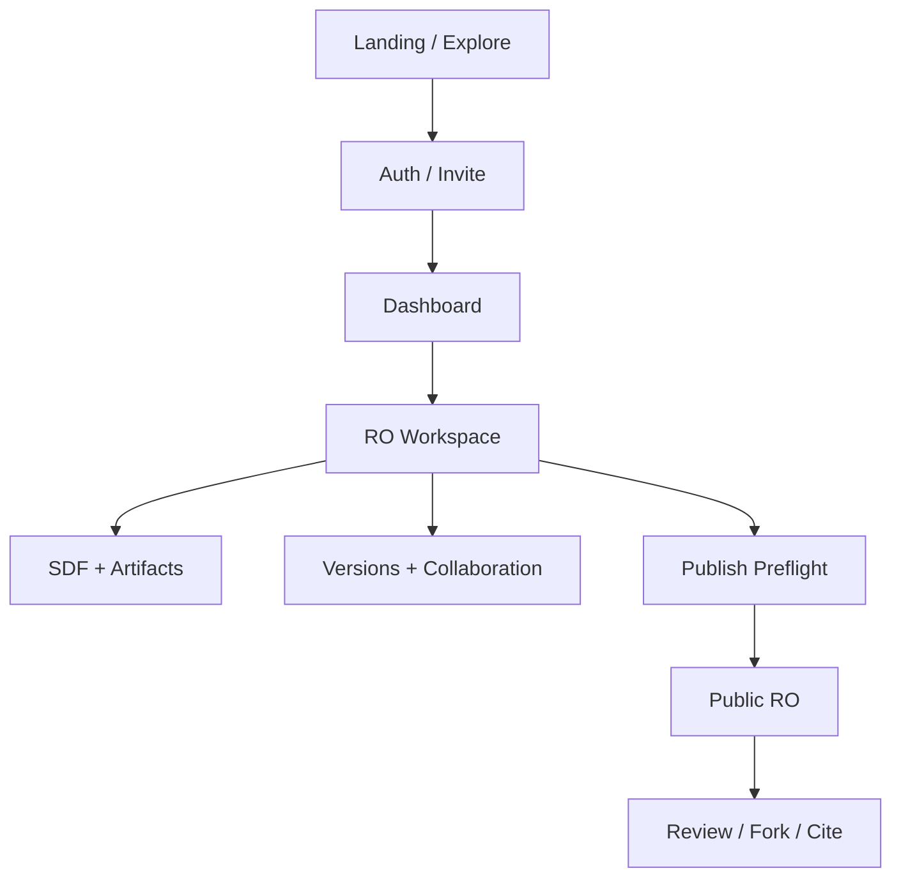

# OpenScience Web Design Masterplan v2.0

> 可直接交给 Codex 执行的产品设计、Figma、动效、素材与前端实施规范  
> 基线：`OpenScience_Kimi_Development_Spec.md`、`2026-08-08-openscience-product-web-design.md`  
> 目标端：Desktop + Mobile；中文优先，首日起支持 i18n  
> 视觉目标：Moonshot 的实时媒介质感 + super-nb 的排版纪律 + 科研工具的可信度  
> 状态：执行基线 v2.0

---

## 0. 一页决策摘要

### 0.1 核心判断

现有页面不好看，不是因为颜色、圆角或阴影没有调好，而是页面语法错误：

1. 把研究对象做成了几个互不关联的卡片，缺少“对象正在演化”的空间关系。
2. 大标题占用首屏，却不承担导航、状态或操作功能。
3. Landing、Dashboard、Workspace、Public RO 使用相同暗色模板，场景辨识度不足。
4. 试图用静态 Figma 图层模拟 WebGL/Canvas，导致主视觉看起来像插画而非实时媒介。
5. Hermes、SDF、版本、协作被当成并列功能，没有围绕当前 Research Object 形成统一上下文。

### 0.2 最终方向

**品牌隐喻：Research Object 是一个持续吸收证据、产生版本和连接协作者的“活体引力系统”。**

- 六个 SDF 字段是六个证据节点，不是六张卡片。
- 版本是轨道/时间切片，不是普通列表。
- Artifact 是证据粒子，可追溯到节点和版本。
- Hermes 是穿行于对象、任务和权限之间的研究伙伴，不是悬浮聊天气泡。
- Public RO 从“仪器暗面”转为“论文纸面”，表达可信阅读与可引用性。

### 0.3 技术组合

| 层 | 选型 | 职责 |
|---|---|---|
| Landing 实时主视觉 | Unicorn Studio 或自研 WebGL/Canvas | 透镜、六节点引力、鼠标扰动、品牌记忆点 |
| Workspace 环境场 | 轻量 Canvas Dot Field | 低对比证据场，只表达环境和状态 |
| UI 动效 | Motion；滚动可加 Lenis | 页面切换、列表重排、审批、状态反馈 |
| Hermes | 现有 Live2D + Cubism Web SDK | 角色表现；与任务状态机绑定 |
| UI 基础 | 现有 Next.js/TypeScript 组件体系 | 表单、菜单、对话框、数据视图、无障碍 |
| Figma | Variables + Components + Prototype | 规则、状态、布局与交互注释；不承担最终 WebGL 质感 |

### 0.4 强制约束

- 一个页面最多一个主视觉效果。
- 不使用通用“玻璃卡片墙”。
- 不使用宇航员、飞船、银河壁纸等科幻陈词滥调。
- 动效必须表达对象关系、版本变化、证据来源或任务状态。
- Landing 可沉浸；Workspace 必须安静；Public RO 必须可长时间阅读。
- 所有实时媒体提供 poster、静态降级和 `prefers-reduced-motion`。

---

## 1. 体验北极星

### 1.1 用户应该感受到什么

| 时刻 | 目标感受 | 设计表达 |
|---|---|---|
| 初次进入 Landing | “这不是论文数据库，而是新的科研媒介” | 单一巨大实时对象、极少文字、鼠标产生有意义的反馈 |
| 进入 Dashboard | “我知道现在最该做什么” | 一个主任务、最近 RO、待确认事项和系统状态 |
| 打开 Workspace | “所有材料都围绕同一个研究对象” | 稳定 Object Header、三栏编辑、SDF 状态连续 |
| Hermes 提建议 | “AI 给的是可核验证据，不是神谕” | 来源片段、置信状态、差异预览和审批范围 |
| 查看 Public RO | “这可以被认真阅读、引用和复现” | 纸面排版、稳定身份、版本/许可/哈希清晰 |
| 查看版本差异 | “研究是如何演化的可被理解” | 结构 diff、结论变化摘要、artifact/许可/作者变化分层 |

### 1.2 三条设计原则

1. **Object before interface**：先让用户看到当前 RO 的身份、状态和结构，再展示工具。
2. **Evidence before decoration**：光、线、节点必须对应证据、关系或任务，不做无语义粒子秀。
3. **Calm density**：信息可以密集，但层级必须安静；用对齐、留白、字号和分隔线组织，而不是处处套卡片。

---

## 2. 四种页面语法

### 2.1 Landing：实时品牌媒介

目的：建立认知、解释核心命题、提供创建与探索入口。

- 背景：`#03070D`，允许 WebGL 主视觉。
- 首屏：左侧 5/12 文案，右侧 7/12 Living RO 实时对象。
- 文案最多：eyebrow 1 行、标题 2–3 行、说明 2 行、2 个动作。
- 首屏不出现功能卡片、价格卡、三列卖点。
- 下滚后通过“对象解剖”解释 SDF 六节点、版本与 provenance。
- 页面尾部转为公共研究对象的浅色预览，预告双表面体系。

建议首屏文案：

```text
OPEN SCIENCE INFRASTRUCTURE

Science is no longer published.
It evolves.

Turn papers, evidence, code and discussion into a living Research Object.

[Create a Research Object]  [Explore public research]
```

中文可作为区域/语言切换后的主文案，不在同一首屏双语堆叠。

### 2.2 Dashboard：研究驾驶舱

目的：回答“我现在应该做什么”。

- 不使用 120px 以上的装饰性页面标题。
- 顶部 64px Global Nav；其下是 52px Workspace/Context Bar。
- 主区采用 8/4 分栏：左侧当前任务和 RO 流；右侧确认队列与 Hermes。
- 首要模块是 `Resume / Primary action`，不是统计数字。
- 最近项目采用行式 Object Lane；只有需要视觉比较时才使用卡片。
- 系统故障/服务等待应进入小型 Status Strip，不占据整个 Hero。

### 2.3 Workspace：科研操作系统

目的：编辑、确认、追踪和协作。

桌面结构：

```text
Global Nav 56
Object Header 64
Mode Tabs 44
------------------------------------------------
Outline 248 | Editor fluid min 620 | Evidence/Hermes 340
------------------------------------------------
Task/Save Status 32
```

- 左栏：章节、SDF 节点、Artifact、版本树。
- 中栏：正文/结构编辑、diff、review 等当前工作面。
- 右栏：证据、Hermes 建议、来源、审批；允许收起到 48px rail。
- `Object Header` 跨所有模式固定存在，显示 RO ID、版本、可见性、保存状态和主动作。
- 不在每个页面重复 Stable Identity、Current Version、Access Scope 三张卡片。

### 2.4 Public RO：学术出版表面

目的：阅读、引用、验证、复现。

- 背景：`#F4F1EA` 或 `#F7F5EF`；正文 `#151716`。
- 最大正文宽度 760px；元数据侧栏 280px。
- 首屏顺序：状态/ID → 标题 → 作者/机构 → Insight → 引用/许可/版本。
- 六节点以章节目录和证据状态呈现，不使用暗色霓虹圆点。
- 版本、Hash、AI 审核、许可为可信组件，视觉上接近学术出版而非 GitHub clone。

---

## 3. 信息架构与导航

### 3.1 一级路由

| 路由 | 页面 | 主要任务 |
|---|---|---|
| `/` | Landing | 理解、创建、探索 |
| `/explore` | Explore | 搜索和浏览公开 RO |
| `/dashboard` | Dashboard | 继续研究、处理任务 |
| `/ro/:id/workspace/*` | Workspace | 编辑、版本、协作、发布 |
| `/ro/:publicId` | Public RO | 阅读、引用、review |
| `/collections/*` | Collection | 期刊/主题策展 |
| `/settings/*` | Settings | 账户、工作区、配额、安全 |

### 3.2 Workspace 模式

按任务组织，而不是按后端数据表组织：

1. Overview
2. Write & SDF
3. Data & Code
4. Versions
5. Collaboration
6. Publish

桌面为横向 Mode Tabs；移动端为底部 4 个常用入口 + “More”抽屉。当前 RO、版本和 Hermes 上下文不可因模式切换丢失。

### 3.3 页面层级



---

## 4. 设计令牌（Design Tokens）

### 4.1 颜色

#### Dark Instrument Surface

| Token | 值 | 用途 |
|---|---:|---|
| `surface.dark.0` | `#03070D` | Landing 最深背景 |
| `surface.dark.1` | `#070B12` | Workspace 背景 |
| `surface.dark.2` | `#0C121C` | 抬升区域/侧栏 |
| `surface.dark.3` | `#121B28` | Hover/选中背景 |
| `line.dark` | `rgba(153,181,214,.16)` | 默认分隔线 |
| `text.dark.primary` | `#F4F7FB` | 主文本 |
| `text.dark.secondary` | `#A7B5C8` | 次文本 |
| `text.dark.tertiary` | `#708096` | 辅助标签 |

#### Scientific Signals

| Token | 值 | 语义 |
|---|---:|---|
| `signal.blue` | `#4F8CFF` | 当前、链接、主要动作 |
| `signal.cyan` | `#65D8E8` | 数据/可复现性 |
| `signal.violet` | `#9B7CFF` | Insight/AI 建议 |
| `signal.amber` | `#E6A65D` | 差异、待确认、异常 |
| `signal.green` | `#55C995` | 已确认、成功 |
| `signal.red` | `#E36B70` | 阻断、危险 |

#### Paper Surface

| Token | 值 | 用途 |
|---|---:|---|
| `surface.paper` | `#F4F1EA` | Public RO 页面 |
| `surface.paper.raised` | `#FBFAF7` | 注释/引用块 |
| `text.paper.primary` | `#151716` | 正文 |
| `text.paper.secondary` | `#515753` | 元数据 |
| `line.paper` | `#D8D4CA` | 规则线 |
| `link.paper` | `#245EA8` | 链接 |

颜色使用规则：一个视图中最多一个高饱和主色；Amber 仅用于待确认/变化，不可作为装饰性渐变。

### 4.2 字体

| 角色 | 字体建议 | 说明 |
|---|---|---|
| Display Latin | Instrument Serif / Source Serif 4 | Landing 和 Public RO 标题 |
| Display Chinese | Noto Serif SC | 中文大标题/学术标题 |
| UI | Geist / Inter + Noto Sans SC | 产品界面 |
| Mono | IBM Plex Mono | ID、Hash、版本、代码、指标 |

字号层级（桌面）：

- `Display XL`: clamp(56px, 6.2vw, 96px), line-height 0.96
- `Display L`: 48/52
- `H1`: 36/42
- `H2`: 28/34
- `H3`: 20/28
- `Body L`: 18/30
- `Body`: 15/24
- `UI`: 14/20
- `Meta`: 12/18，字距 0.04em
- `Mono Meta`: 11/16，字距 0.08em

移动端：Display XL 44/44；H1 32/38；正文不得小于 15px。

### 4.3 间距、栅格和半径

- 基础间距：4px；常用序列 `4, 8, 12, 16, 24, 32, 48, 64, 96, 128`。
- Desktop 内容宽度：最大 1440px；左右安全边距 48–72px。
- Landing：12 栏，24px gutter。
- Product：固定侧栏 + fluid 内容；主内容不套统一居中容器。
- Public RO：主文 760px + 40px gutter + 280px metadata。
- 圆角：输入/按钮 8px；普通容器 12px；对话框 16px；禁止普遍使用 24–32px 大圆角。
- 阴影主要用于浮层；常驻内容通过边界、色阶和空间区分。

---

## 5. 核心页面规格

### 5.1 Landing Desktop

#### 首屏（100svh，最小高度 720px）

- Global Nav：72px；左右 56px。
- Logo 左；中部仅 `Explore / How it works / Ultrafast Science`；右侧 `Sign in` 和主要按钮。
- 文案容器：左 8%，顶 28%，宽 42%。
- 实时对象：右 44%，直径约 `min(58vw, 780px)`，允许越出视口 8%。
- 首屏 CTA 高 48px；主/次动作总宽不超过 420px。
- 右下角显示实时对象 legend：`6 evidence nodes · 12 artifacts · v0.4`，只作为演示数据。
- 鼠标靠近对象时产生局部透镜和节点偏移；不得让整个页面跟随鼠标旋转。

#### 第二屏：A Research Object is alive

- 左侧 4/12：固定标题和说明。
- 右侧 8/12：滚动展开六节点；每段只激活一个节点，其余降低至 20% 亮度。
- 节点顺序：Problem → Insight → Method → Results → Limitations → Reproducibility。
- 不能做成六张同时出现的功能卡片。

#### 第三屏：Evidence → Version → Review

- 横向时间结构：source artifact 进入节点，形成版本快照，被 review 锚定。
- 使用线性滚动叙事；移动端改为纵向。

#### 第四屏：Public research preview

- 背景由 dark 过渡到 paper；展示一个真实 Public RO 摘要视图。
- 结束 CTA：Create / Explore。

### 5.2 Landing Mobile

- 首屏 100svh；导航 56px。
- 对象直径约 84vw，位于顶部 16%–55%；文案在下半区。
- 主标题最多 4 行；两个 CTA 垂直排列或主按钮 + 文本链接。
- 触摸交互为拖拽/轻微视差；禁用持续陀螺仪输入。
- 粒子数量为桌面的 25%–35%；模糊半径减半。

### 5.3 Dashboard Desktop

#### 顶部

- Global Nav 56px。
- Context Bar 52px：Workspace selector / Search / Create / Credits / User。
- 若服务异常，在 Context Bar 下出现 32px Status Strip；可关闭/查看详情。

#### 主区

左侧 8 栏：

1. `Continue research`：当前 RO、最近动作、下一任务、主按钮。
2. `Research Objects`：行式列表，每行含状态轨迹、版本、更新时间、协作者和 pending count。
3. `Recent activity`：按 RO 分组的时间线。

右侧 4 栏：

1. `Needs your confirmation`：Hermes/SDF/review/permission 的可操作队列。
2. `Hermes`：角色状态、当前任务、最近建议；Live2D 仅显示上半身或头像态。
3. `Usage`：AI Credit 和存储，只显示接近阈值的项。

空状态不能只写“等待服务”。必须提供可继续的动作、重试和诊断 ID。

### 5.4 RO Workspace Desktop

#### Object Header

固定字段：

- Title（截断）
- `OSR-2026-000001`
- `v0.4 draft`
- Visibility
- Save state
- Branch/Review count（如存在）
- 主动作：`Save version` 或 `Publish`，按当前状态决定

点击 ID/版本弹出 Identity Popover，里面展示 Hash、许可、所有权和历史；不占据首页三张卡片。

#### Outline Rail（248px）

- 文档章节
- 六 SDF 节点及状态
- Artifacts
- Versions
- 可折叠、可键盘导航

#### Editor（fluid）

- 内容列最大 820px，但编辑画布可容纳表格和媒体。
- 顶部 contextual toolbar；不放一整排永久工具。
- AI 建议以 inline proposal/diff 出现，不直接改正文。

#### Evidence/Hermes Rail（340px）

Tabs：`Evidence / Hermes / Review`。

- Evidence：来源片段、artifact、引用、置信状态。
- Hermes：当前任务、建议、批量 diff、预计费用/耗时。
- Review：锚定当前段落/节点的意见。
- 收起后为 48px rail，显示未读数量和任务状态。

### 5.5 Workspace Mobile

- 顶部 52px Object Bar：返回、标题、版本、更多。
- 主内容单列；当前模式标题下显示节点状态。
- 底部导航：Overview / SDF / Files / Versions / More。
- Outline、Evidence、Hermes 使用独立 bottom sheet，不嵌套多个 sheet。
- 高风险审批使用全屏 Review Changes 页面，不能使用小型 confirm。

### 5.6 Public RO Desktop

- 顶部公共导航高度 64px，使用 paper surface。
- Hero 主栏 760px；右侧 metadata rail 280px。
- Title 48–64px serif，行宽控制在 16–22 个中文字符或 12–16 个英文单词。
- Insight 是首个内容块，使用 20/32，不使用蓝色大卡片。
- 作者、机构、ORCID/身份状态紧跟标题。
- Metadata rail：RO ID、version、published time、license、hash、citation actions。
- 正文目录可 sticky，但只突出当前章节。
- 六节点状态在目录中显示；颜色只是辅助，必须有文本状态。
- AI 审核摘要放在方法与出处区域，不作为“质量分数”。

### 5.7 Explore 与 Collection

- Explore 以搜索和研究身份为主，不做社交瀑布流。
- 搜索框首屏可见；筛选采用可折叠 filter rail。
- RO Result 是水平行：标题/作者/Insight/状态/版本/许可/代表 artifact。
- Collection 可使用大图和编辑排版，但必须明确 `Selected by`，不能误导为 peer-reviewed。

---

## 6. 组件系统：Figma 与代码职责

### 6.1 Foundations

| Figma 资产 | 功能 | 代码映射 |
|---|---|---|
| Color Variables | 双表面、信号色、状态色；支持 mode | CSS variables / Tailwind theme |
| Typography Styles | Display、UI、Mono、Paper 正文 | font tokens / utility classes |
| Spacing Variables | 4px 系列、页面边距、栏宽 | spacing tokens |
| Grid Styles | Landing 12 栏、Product rails、Public reading | layout primitives |
| Effect Styles | 仅浮层、focus、glow；限制滥用 | box-shadow/filter tokens |
| Motion Tokens | duration/easing/distance | Motion transition presets |

### 6.2 Primitives

| 组件 | 必要 Variants | 功能 |
|---|---|---|
| Button | primary/secondary/ghost/danger；sm/md/lg；loading | 主次动作与危险操作 |
| IconButton | default/selected/quiet；tooltip | 工具栏和 rail 操作 |
| Field | input/textarea/select；default/error/disabled | 表单与编辑元数据 |
| Tag | status/topic/license/visibility | 短语义标签；不得代替正文 |
| Tooltip | top/right/bottom/left | 解释图标和缩写 |
| Popover | identity/filter/action | 就地查看轻量信息 |
| Dialog | standard/high-risk | 普通确认和高风险变更 |
| Sheet | left/right/bottom/fullscreen | Mobile rail 和 Hermes |
| Tabs | line/segmented/vertical | 模式与 rail 视图 |
| Toast | success/error/progress | 可撤销和后台任务反馈 |

### 6.3 Research-domain Components

| 组件 | 视觉/交互职责 | 禁止用法 |
|---|---|---|
| `ROIdentity` | ID、版本、状态、哈希入口 | 拆成三张统计卡 |
| `ObjectHeader` | 在所有 Workspace 模式维持对象上下文 | 每页重复创建不同 header |
| `SDFNode` | 节点名称、状态、证据数、定位 | 单纯发光装饰点 |
| `SDFOrbit` | Landing/Overview 中表达六节点关系 | Workspace 背景持续大幅动画 |
| `EvidenceSnippet` | 来源原文、位置、artifact、置信状态 | 只给 AI 结论不给来源 |
| `ArtifactRow` | 类型、来源、版本、许可、大小、状态 | 所有 artifact 做图片卡 |
| `VersionMarker` | 版本、时间、作者、变化类型 | 用颜色替代版本号 |
| `DiffBlock` | before/after、确定性 diff、AI 摘要 | 只显示 AI 总结 |
| `ReviewAnchor` | 锚定字段/段落/版本的评论 | 无版本上下文的漂浮评论 |
| `PreflightItem` | blocking/warning/passed 与修复动作 | 单一总评分 |
| `ApprovalBatch` | 变更范围、diff、成本、可撤销性 | 每个小改动弹一次确认 |
| `ObjectLane` | Dashboard 的 RO 进度与下一任务 | 大面积空卡片 |

### 6.4 Hermes Components

| 组件 | 功能 |
|---|---|
| `HermesAvatar` | Live2D/静态 poster 容器；响应状态机 |
| `HermesRail` | Workspace 常驻入口；收起/展开 |
| `HermesTask` | 任务名称、步骤、进度、预计耗时、费用 |
| `HermesSuggestion` | 建议 + 证据 + 影响范围 |
| `HermesBatchReview` | 批量预览 R1/R2 操作 |
| `HermesPermissionScope` | 当前授权范围、持续时间、撤销入口 |
| `HermesFailure` | 可理解错误、重试、诊断 ID、保留的草稿 |

### 6.5 Navigation Components

- `GlobalNav`：品牌、全局探索、搜索、创建、账户。
- `ContextBar`：Workspace 与当前任务环境。
- `ModeTabs`：RO 内六个工作模式。
- `OutlineRail`：文档与 SDF 层级。
- `MobileObjectBar`：移动端当前对象和版本。
- `MobileModeNav`：核心模式入口；更多功能进 More。

---

## 7. Figma 文件结构与每页功能

```text
00 Cover
01 Foundations
02 Primitives
03 Research Components
04 Patterns
05 Screens — Landing
06 Screens — Product
07 Screens — Public
08 Prototype Flows
09 Motion & Media
10 Handoff
99 Archive
```

### 7.1 `00 Cover`

- 项目名、版本、负责人、更新时间、状态。
- 当前设计原则和变更日志入口。
- 不放产品页面供评审，避免误把 Cover 当最终稿。

### 7.2 `01 Foundations`

- Variables：Light/Dark modes、语义颜色、字号、间距、半径。
- Grid：Desktop 1440、Laptop 1280、Tablet 768、Mobile 390。
- Typography specimen：中英文、数字、公式、ID、Hash。
- Accessibility：对比度、focus ring、reduced motion 示例。

### 7.3 `02 Primitives`

- 只放通用组件和所有 states/variants。
- 每个 component set 标注 anatomy、尺寸、键盘行为和代码名称。
- 禁止混入 RO 业务语义。

### 7.4 `03 Research Components`

- 放 ROIdentity、SDFNode、EvidenceSnippet、VersionMarker、DiffBlock 等业务组件。
- 每个组件至少展示 default/loading/empty/error/permission-denied。
- 标注数据字段和事件，不只画视觉。

### 7.5 `04 Patterns`

- Create flow、Hermes proposal、Batch approval、Publish preflight、Review、Version diff。
- Pattern 是多个组件组成的任务单元，不能复制成另一个不可维护组件。

### 7.6 `05–07 Screens`

- 每个页面按断点和状态排布。
- 页面名称格式：`[Surface] / [Screen] / [Breakpoint] / [State]`。
- 示例：`Product / Workspace SDF / Desktop / Hermes proposing`。

### 7.7 `08 Prototype Flows`

至少提供六条可点击路径：

1. Landing → Invite/Auth → Dashboard。
2. Dashboard → Create RO → Hermes parse → SDF confirm。
3. Workspace edit → Save version。
4. Review comment → Author response → Resolve。
5. Publish preflight → Approval → Public RO。
6. Public RO → Cite/Fork/Review。

### 7.8 `09 Motion & Media`

- 放 WebGL poster、视频/Canvas 录屏、Live2D 状态、动效曲线和降级图。
- Figma prototype 只模拟节奏；真实效果以浏览器 prototype 为准。
- 每个媒体标注：runtime、文件大小、触发方式、fallback、owner、license。

### 7.9 `10 Handoff`

- 页面/组件与代码路径映射。
- Token 名称与 CSS variable 映射。
- 断点、空状态、错误状态、事件和 analytics。
- 未决问题、已接受偏差、性能预算。

---

## 8. 动效与鼠标交互规范

### 8.1 动效等级

| Level | 范围 | 时长 | 示例 |
|---|---|---:|---|
| M0 | 即时反馈 | 80–120ms | 按钮按下、focus |
| M1 | 微交互 | 160–220ms | hover、tab、popover |
| M2 | 结构变化 | 260–420ms | rail 展开、列表重排、diff |
| M3 | 叙事动效 | 600–1200ms | Landing 节点聚合、页面表面过渡 |
| Ambient | 持续 | 8–30s loop | 低强度粒子、透镜呼吸 |

推荐 easing：

- Enter：`cubic-bezier(.16,1,.3,1)`
- Exit：`cubic-bezier(.7,0,.84,0)`
- Move：`cubic-bezier(.22,1,.36,1)`
- 弹性仅用于 Hermes 非严肃状态；审批/发布禁用弹簧抖动。

### 8.2 Landing 指针模型

- 指针影响半径：桌面 180–260px。
- 节点最大位移：12–22px。
- 透镜/折射最大强度：默认的 1.25 倍。
- 输入使用缓动后的坐标，不直接绑定原始 `mousemove`。
- 离开窗口 500–800ms 回归稳定轨道。
- 点击节点：锁定并显示 label/provenance preview；再次点击或 Esc 退出。
- 不使用自定义光标替代系统指针；可增加 16–24px halo，但必须保持可用性。

### 8.3 Workspace 环境场

- Canvas opacity：2%–6%；文本区域通过 CSS mask 再降低 40%。
- 静止时几乎不可见；仅在保存、生成版本、收到 review 时出现局部波纹。
- 指针只影响 80–120px 局部点阵，位移不超过 4px。
- 页面失焦或电池节能时停止 requestAnimationFrame。

### 8.4 滚动

- Smooth scroll 只用于 Landing；Product 页面保持原生滚动响应。
- 滚动驱动动画必须基于 section progress，不锁死滚轮。
- 不做长时间 scroll-jacking。
- 触摸端不依赖 hover 才能获得信息。

### 8.5 Reduced Motion

- WebGL/Canvas 使用静态 poster。
- 自动播放视频停止在第一帧。
- 页面转换改为 120ms opacity。
- Live2D 保留必要状态图标，禁用持续 idle 大动作。

---

## 9. Hermes Live2D 状态系统

### 9.1 状态机

| 状态 | 视觉 | UI 行为 |
|---|---|---|
| `idle` | 低频呼吸、视线轻微跟随 | rail 收起或安静显示 |
| `listening` | 注视输入区域、小幅靠近 | 展示当前读取范围 |
| `thinking` | 视线转向、状态环缓慢运行 | 显示步骤、预计耗时、停止按钮 |
| `proposing` | 指向建议区域 | 打开 suggestion + evidence |
| `waiting_approval` | 动作停止、严肃中性 | 强调 diff 和权限，不娱乐化 |
| `executing` | 小幅工作动作 | 显示进度、费用和可取消性 |
| `success` | 1 次短反馈后回 idle | Toast + 变更摘要 |
| `warning` | 中性关注，不夸张惊讶 | 显示可恢复问题 |
| `error` | 静止/弱化 | 错误、保留内容、重试、诊断 ID |

### 9.2 尺寸与位置

- Dashboard：右栏容器高 240–320px；角色不超过容器 70%。
- Workspace expanded rail：角色 160–220px 高；编辑/diff 时可自动收至头像态。
- Mobile：bottom sheet 顶部 120–160px；键盘打开后切为 40px avatar。
- Public RO：默认不常驻，只在用户主动“Ask Hermes about this RO”后出现。

### 9.3 接入契约

前端只向 Live2D adapter 发送语义状态，不直接调用零散 motion 名称：

```ts
type HermesVisualState =
  | 'idle' | 'listening' | 'thinking' | 'proposing'
  | 'waiting_approval' | 'executing' | 'success'
  | 'warning' | 'error';
```

Adapter 负责映射模型动作、表情、视线、降级 poster 和资源加载。

---

## 10. 素材系统

### 10.1 目录建议

```text
apps/web/public/media/
├── brand/
│   ├── hero-ro-poster.avif
│   ├── hero-ro-poster-mobile.avif
│   └── hero-ro-scene.json
├── fields/
│   ├── workspace-field.avif
│   └── noise-128.webp
├── hermes/
│   ├── model/
│   ├── motions/
│   ├── expressions/
│   ├── poster.webp
│   └── LICENSE.md
├── artifacts/
│   └── demo-ro/
└── provenance/
    └── media-manifest.json
```

### 10.2 每个素材必须记录

- `id`
- `type`
- `purpose`
- `source/generator`
- `prompt`（AI 生成时）
- `createdAt`
- `license`
- `owner`
- `version`
- `fallback`
- `alt`
- `maxBytes`

### 10.3 本轮生成素材的使用建议

1. **Living Research Object Hero**：作为 Landing poster 或 Unicorn/WebGL 场景构图参考；HTML 文案放左侧。
2. **Workspace Scientific Field**：作为开发前的视觉基线；生产应优先用轻量 Canvas/CSS 重建，并将强度控制在 2%–6%。

AI 图不能直接被当作最终交互。它定义光线、色彩、密度和构图；真实节点、标签和指针响应由运行时代码实现。

---

## 11. 响应式

| 断点 | 宽度 | 策略 |
|---|---:|---|
| Mobile S | 320–374 | 单列，最小触控 44px |
| Mobile | 375–767 | bottom navigation / sheet |
| Tablet | 768–1023 | 双栏或 rail overlay |
| Laptop | 1024–1279 | Outline 220 + content + overlay rail |
| Desktop | 1280–1599 | 完整三栏 |
| Wide | ≥1600 | 限制正文宽度，扩展环境留白，不放大所有 UI |

关键规则：

- 功能 parity 不等于布局 parity。
- Mobile 不压缩三栏；把 rail 变为任务驱动的独立 surface。
- Landing 主视觉移动端重新构图，不使用单纯 `background-size: cover`。
- Public RO metadata 移到标题下的 accordion/drawer。

---

## 12. 无障碍与性能预算

### 12.1 无障碍

- WCAG 2.2 AA。
- 文本对比度 ≥ 4.5:1；大文本 ≥ 3:1。
- 所有节点/Canvas 信息有 DOM 等价内容。
- Focus ring 使用 2px `signal.blue` + 2px offset。
- 拖拽功能提供键盘/按钮替代。
- Live2D 不承载唯一信息；状态同时以文本/图标呈现。
- 公共研究内容具备语义 heading、figure/figcaption、table caption 和 alt。

### 12.2 性能

| 项目 | 目标 |
|---|---:|
| LCP | ≤ 2.5s（p75） |
| CLS | ≤ 0.1 |
| INP | ≤ 200ms |
| Landing poster | desktop ≤ 300KB AVIF；mobile ≤ 180KB |
| Workspace background | ≤ 180KB；或代码生成 |
| Live2D | 首屏不加载；按需分包 |
| WebGL | desktop 稳定 55–60fps；mobile ≥ 30fps |
| 粒子 | desktop 8k–20k；mobile 1.5k–4k，按设备降级 |

- 先渲染 poster 和 DOM 文案，再异步初始化实时场景。
- `navigator.deviceMemory`、GPU/帧率和 reduced-motion 决定质量档位。
- 页面不可见时暂停动画。
- Canvas DPR 上限建议 desktop 1.5，mobile 1.25。

---

## 13. Codex 执行行动指南

### Phase 0 — 代码审计（0.5–1 天）

Codex 必须先完成：

1. 阅读根目录 `AGENTS.md` 和产品基线。
2. 输出实际 monorepo/route/component/style/media 结构。
3. 检查 `git status`，保护已有改动。
4. 找出 Landing、Dashboard、Workspace、Public RO 的入口。
5. 记录字体、tokens、组件库、Motion/WebGL/Live2D 依赖。
6. 启动现有应用，截取 desktop/mobile 基线。
7. 建立 `docs/adr/ADR-visual-runtime.md`，说明 Unicorn vs custom Canvas 的决策。

**Phase 0 验收物：**审计报告、页面矩阵、风险清单、改造顺序；不能直接重写。

### Phase 1 — Foundations 与 Product Shell（1–2 天）

1. 建立双表面 CSS variables。
2. 导入/自托管字体，确保中英文 fallback。
3. 实现 `GlobalNav`、`ContextBar`、`ObjectHeader`、`ModeTabs`。
4. 实现 Desktop/Tablet/Mobile shell。
5. 加入 focus、reduced-motion 和 skeleton 基线。
6. 建立 Storybook 或组件展示 route（若项目已有相应设施则复用）。

**验收：**四个断点无横向溢出；键盘可完整导航；Object Header 在模式切换间稳定。

### Phase 2 — Landing Live Prototype（2–4 天）

1. 先用本轮 Hero poster 完成静态构图。
2. 建立 `HeroStage` 接口：poster / runtime scene / reduced mode。
3. 选定 Unicorn Studio scene 或 Canvas/WebGL 实现。
4. 实现六节点 DOM overlay 与 pointer model。
5. 实现第二屏节点解剖和 dark→paper 过渡。
6. 加入性能质量档与暂停逻辑。

**强制评审：**浏览器内录制 1440×900、390×844；不以 Figma 动画作为验收。

### Phase 3 — Dashboard 与 Workspace（3–6 天）

1. 移除当前巨型空状态和三张身份卡。
2. 身份信息收束到 `ObjectHeader` 和 `IdentityPopover`。
3. Dashboard 改为 Continue Research + Object Lanes + Confirmation Queue。
4. Workspace 建立三栏，保持现有业务数据和路由。
5. SDF 节点加入状态、证据数和定位。
6. Hermes 建议使用 proposal/diff，不直接覆盖。
7. 环境场只在 shell 背景运行并通过 mask 远离正文。

**验收：**在 10 秒内能找到当前版本、下一任务、未确认事项和保存版本入口。

### Phase 4 — Public RO（2–4 天）

1. 建立 paper tokens 和阅读模板。
2. 完成 RO identity、authors、Insight、SDF TOC、metadata rail。
3. 完成 citation、license、hash、version、AI review disclosure。
4. Artifact 使用 figure/caption/provenance。
5. Mobile 重排 metadata 和目录。

**验收：**打印/PDF 基本可读；正文宽度、标题行长、脚注和表格满足学术阅读。

### Phase 5 — Hermes Live2D（2–5 天，取决于资产完整度）

1. 审计模型文件、SDK 版本和许可证。
2. 建立 `HermesVisualAdapter`，只接受语义状态。
3. 懒加载模型；提供 poster 和失败降级。
4. 将任务状态、审批、错误连接到状态机。
5. 编辑/diff/review 时实现 quiet mode。

### Phase 6 — QA 与上线（2–3 天）

1. Playwright 关键路径和视觉截图。
2. axe/WCAG、键盘和 reduced-motion 测试。
3. Lighthouse 和真实移动设备性能。
4. WebGL context loss、低端设备和资源失败降级。
5. Sentry/日志记录初始化失败，不上传科研正文。
6. 灰度发布；保留旧版 feature flag 一周。

---

## 14. 可直接复制给 Codex 的总任务

```text
你正在重构 OpenScience Web。先阅读 AGENTS.md、产品基线和
OpenScience_Design_Masterplan_v2.md。不要立即重写代码。

第一步只做只读审计：输出实际技术栈、路由、组件、样式、媒体、Live2D、
测试和部署结构；检查 git status；启动项目并保存 desktop/mobile 基线截图。

设计目标：
1. Landing 是单一实时 Living Research Object 主视觉；
2. Dashboard 是任务驾驶舱，不是卡片墙；
3. Workspace 是稳定三栏科研编辑器；
4. Public RO 是浅色学术阅读表面；
5. 六个 SDF 字段是证据节点；Hermes 输出必须包含来源、diff 和审批范围。

实施必须保留现有业务和数据契约，按 Phase 0–6 分阶段提交。每个 Phase 先给
修改计划和文件清单，再实现，再运行类型检查、测试、构建和视觉回归。
不得用新增渐变、玻璃卡和随机粒子掩盖布局问题。所有实时媒体必须提供 poster、
reduced-motion、低端设备降级和 context-loss fallback。
```

### Landing 专项任务

```text
实现 HeroStage：DOM 文案在左，Living Research Object 在右。先接 poster，
再接 Unicorn Studio 或自研 WebGL。六节点必须有 DOM 等价结构，指针只影响
180–260px 局部范围，节点最大位移 22px。初始化实时场景不得阻塞 LCP。
提供 desktop/mobile 构图、reduced-motion poster、页面隐藏暂停和质量档。
```

### Workspace 专项任务

```text
将当前 Research object overview 的巨型标题和三张身份卡重构为 ObjectHeader、
IdentityPopover、Continue task 与状态区域。建立 248px Outline、fluid Editor、
340px Evidence/Hermes 三栏；右栏可收至 48px。保持现有 API 和数据逻辑。
所有空/错误状态必须提供下一动作、重试和诊断 ID。
```

---

## 15. 验收清单（Definition of Done）

### 视觉

- [ ] Landing 首屏只有一个主视觉焦点。
- [ ] 首屏在 3 秒静态观看下仍成立，不依赖动画遮丑。
- [ ] Dashboard 不存在等权三卡身份展示。
- [ ] Workspace 的对象、版本、保存状态始终可见。
- [ ] Public RO 与 Product 表面明显不同，但 tokens/身份组件一致。
- [ ] 中英文标题、ID、Hash、公式和长作者列表均测试。

### 交互

- [ ] 指针动效有语义且不会干扰点击。
- [ ] Touch 不依赖 hover。
- [ ] Hermes 每次建议均能查看来源和影响范围。
- [ ] R3/R4 操作有明确摘要和确认。
- [ ] Undo/撤销路径可见。

### 状态

- [ ] Loading、empty、error、offline、permission denied、success 均有设计。
- [ ] WebGL/Live2D 加载失败不阻断页面。
- [ ] 低端设备和 reduced-motion 可用。
- [ ] 长标题、长 institution、50+ artifact、100+ review 不破版。

### 工程

- [ ] Typecheck、lint、unit/e2e、build 通过。
- [ ] 无未处理 console error。
- [ ] LCP/CLS/INP 达标。
- [ ] Canvas 不泄漏 RAF、event listener 或 GPU context。
- [ ] 媒体 license/provenance 清楚。
- [ ] 视觉回归覆盖 1440×900、1280×800、768×1024、390×844。

---

## 16. 明确禁止的设计

- 每个模块都加发光描边和大圆角。
- 把六 SDF 节点画成六张等大的功能卡。
- Dashboard 使用 80–120px 的装饰性标题。
- 长期旋转星空、镜头晕动和强烈 cursor trail。
- Public RO 使用全黑背景阅读长文。
- Hermes 在审批、错误、review 时做娱乐化表情。
- 所有断点使用同一构图缩放。
- 为追求动效引入多个互相竞争的动画引擎。
- 先购买大量太空素材，再寻找使用场景。

---

## 17. 最终判断标准

不要问“它是否像 Moonshot”。应问：

1. 在隐藏 Logo 后，是否仍能认出这是 OpenScience，而不是通用 AI 官网？
2. 动效是否让用户更理解证据、节点、版本与协作关系？
3. 进入 Workspace 后，动效是否主动退场，让科研内容成为主角？
4. Public RO 是否足够可信、稳定、可引用，能承载真正的学术成果？
5. 用户能否在十分钟内创建 RO，并理解 Hermes 提取的每个字段来自哪里？

五项都满足，才算“高质量网站”，而不仅是“有高级动效的网站”。
