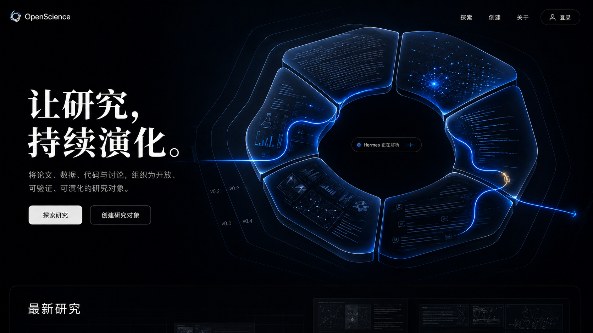

# OpenScience 前端设计方向 v2：Kimi 实施交接

> 日期：2026-08-06  
> 状态：用户 × GPT 讨论后形成的实施方向  
> 上游文档：`2026-08-06-frontend-design-direction-v1.md`  
> 本文件用途：供 Kimi 合并进正式 design spec 并拆解实施计划，不是可直接照搬的页面代码。

## 1. 最终方向（一句话）

OpenScience 的视觉定位更新为：

> **Monumental Scholarly Intelligence（具有纪念碑感的学术智能）**——Moonshot 式的克制、尺度与品牌冲击力，叠加开放科学所特有的结构化、可验证、可协作与持续演化。

首页应当“震撼、简约、AI 原生”；进入产品后则回归高效率和长时间阅读舒适度。不要把所有页面都做成首页式暗场。

## 2. 已确认决策

1. 首页第一目标：让新用户在 30 秒内理解平台价值，并能立即浏览真实 Research Object（RO），不是纯营销页。
2. 典型工况：长时间阅读、撰写、修改科研内容。
3. 工作台：深色导航外壳 + 浅色内容画布；首版不提供完整浅/暗主题切换，但 token 结构必须预留。
4. 品牌气质：精密、冷静、可信，辅以少量人文温度；不是传统期刊站，也不是炫技型 AI SaaS。
5. 信息密度：中等密度。核心内容区舒展，列表、搜索和协作区紧凑。
6. Hermes 沿用 Scholar's Tea 的 wanko Live2D，形成同一 AI 宇宙。
7. Hermes 可以活泼；严谨性约束的是学术回答、证据标准、不确定性表达和审批行为，而不是把角色做得沉闷。
8. 首页不采用 scroll-jacking。用可点击的四阶段演化面板解释 RO 流程。
9. 首页采用浅色内容之外的例外：首屏是沉浸式近黑暗场；公开 RO 正文仍使用浅色学术出版风。

## 3. 首页核心概念

### 3.1 核心符号：Evolving Research Object

取消“飞秒脉冲/棱镜”作为全站主符号。它们过于偏光学，也缺乏平台辨识度。

主符号改为一个巨型的、持续演化的 Research Object：

- 六个知识面组成一个统一对象，而不是六张悬浮卡片；
- 中心保持开放，表示 Open、可扩展和外部贡献；
- 细薄的历史轮廓表示 provenance 与旧版本；
- 一条由 Hermes 驱动的蓝色智能轨迹穿过对象；
- 一个极小的暖橙节点只用于表示 diff；
- 轨迹产生一次分支，完成修改后重新 merge；
- 六个面在视觉上可暗示论述、数据、代码、方法、证据/图像、讨论，但实现时必须映射真实 SDF schema，不得为了画面擅自修改数据模型。

视觉必须首先读作“一个研究对象”，其次才读出六种内容；禁止重新变成文档堆、PDF 书架或 Dashboard 卡片墙。

### 3.2 首页效果图



此图是 art-direction reference，不是上线资产。正式页面的文字、导航、按钮、状态和研究列表必须用真实 HTML 实现，禁止把整张效果图直接作为首屏背景。

### 3.3 效果图的保留与修正

必须保留：

- 近黑全视口暗场；
- 单一巨型符号占据约 55%–65% 视口；
- 左侧超大使命文案；
- 极少导航和双 CTA；
- 冷蓝主光 + 单点暖橙 diff；
- 底部只露出“最新研究”的入口，推动自然滚动。

实现时修正：

- 进一步减少细碎发光线；
- 六面之间更连贯，避免普通环形菜单感；
- 不依赖大量微型假 UI 来表达科技感；
- 中心负空间应成为可识别轮廓；
- “Hermes 正在解析”仅是轻量状态，不要成为第三个 CTA。

## 4. 首页内容与信息顺序

### 4.1 Header

- 左：OpenScience wordmark；
- 右：`探索`、`创建`、`关于`、`登录`；
- 首屏透明，滚动后变为带轻微模糊的深色栏；
- 不要在首屏堆产品、解决方案、价格、资源等 SaaS 式多级导航。

### 4.2 Hero 文案

主标题：

> **让研究，持续演化。**

说明：

> 将论文、数据、代码与讨论，组织为开放、可验证、可演化的研究对象。

CTA：

- 主按钮：`探索研究`
- 次按钮：`创建研究对象`

CTA 必须直接对应真实路由；邀请制阶段若创建受限，点击后进入登录/邀请码说明，不显示虚假可用状态。

### 4.3 最新研究

紧接 Hero，使用真实 RO feed，而不是假数据截图。首屏底部只露出标题和卡片上沿，第二屏完整展示。

统一 RO Card 至少包含：标题、作者与认证状态、当前版本、更新时间、演化/讨论计数、许可。卡片视觉应低调，内容本身成为界面。

### 4.4 四阶段演化面板

使用同一个 RO 贯穿四个阶段：

1. 创建 Research Object；
2. Hermes 解析并形成结构；
3. 协作者提出修改并产生 Diff；
4. 合并为新版本并公开发布。

桌面端为可点击 stepper，同一对象用 morph 转场；空闲时可低速自动推进一次，之后停止。移动端为可滑动卡片。不得接管滚动、强迫用户观看或无限循环播放。

### 4.5 后续区块

只保留三个：

1. `研究如何演化`：上述四阶段面板；
2. `Hermes 与你共同研究`：展示上下文理解、证据检查和审批，而不是罗列“万能 AI”能力；
3. `开放但可信`：身份、版本、许可、评审与 provenance。

首页不做 Bento 功能大全，不堆十几个能力卡片。

## 5. Hermes 设计契约

### 陪伴模式

适用：首页、Dashboard、空状态、引导。wanko 可以活泼、有随机小动作和轻松气泡。首屏前 1.5 秒不出现大动作，避免与核心符号争夺注意力；之后可从右下角自然出现。

### 研究模式

适用：编辑、文献分析、数据解释、评审。动作可以有生命力，但输出必须：

- 区分事实、来源、推断与建议；
- 明确不确定性；
- 不伪造文献、结果或执行状态；
- 对高影响修改给出可预览 diff；
- 学术内容不使用轻佻措辞。

### 审批模式

适用：发布、删除、合并、高风险 Agent 操作。Hermes 停止玩笑，明确展示对象、范围、影响、可恢复性和审批按钮。R0–R4 决定介入强度。

## 6. 三套页面视觉系统

| 场景 | 视觉策略 | 目的 |
|---|---|---|
| 落地页 Hero | 近黑暗场、纪念碑尺度、极简内容 | 品牌冲击和概念解释 |
| Dashboard / 编辑器 | 深色外壳 + 浅色内容画布 | 长时间工作舒适、AI 状态清晰 |
| 公开 RO | 纸白、学术出版排版、近零动效 | 阅读、引用和可信度 |
| 协作区 | 跟随系统外壳、高密度表格/列表 | PR、Diff、Review 效率 |

三者共享 spacing、radius、状态色和交互逻辑，不共享同一种背景与密度。

## 7. 视觉 Token 建议

以下是方向值，实施前需做 WCAG 对比度验证：

```css
--hero-bg: #03060B;
--hero-surface: #08101C;
--hero-text: #F4F7FB;
--hero-muted: #99A5B5;
--accent-primary: #4C8DFF;
--accent-primary-strong: #256BFF;
--accent-diff: #FFB454;
--canvas-bg: #F6F7F9;
--paper-bg: #FCFBF7;
--ink: #18202B;
--border-subtle: rgba(148, 163, 184, 0.18);
```

- 暖橙只表示新增、变化或合并点，不作为普通按钮色；
- 不使用大面积紫色渐变；
- 首屏主标题可用思源宋体/高质量中文衬线，UI 与正文使用思源黑体/系统无衬线；
- 英文展示字体 Fraunces 只在与中文衬线协调时使用；不要为了坚持字体方案破坏中英文一致性。

## 8. 动效与 AI 科技感

科技感来自“对象被理解和重组”，不是来自粒子数量。

- Hero 对象：8–12 秒一次极轻的呼吸/结构张力变化；
- Hermes 轨迹：4–6 秒完成一次扫描，停留后只保留低亮状态；
- Diff：橙点只短暂增强一次，不持续闪烁；
- 历史版本：随指针产生不超过 4 px 的视差；
- 四阶段面板：使用 layout morph；
- hover/focus：≤200 ms；
- `prefers-reduced-motion` 下全部退化为静态视觉；
- 禁止 scroll-jacking、全屏粒子雨、无限快速旋转和大面积光污染。

## 9. 实现策略

效果图不应直接上线。建议分层实现：

1. HTML 层：导航、标题、说明、CTA、Hermes 状态、最新研究全部是真实 DOM；
2. 核心对象层：优先用设计资产 + SVG 遮罩/轮廓实现；首版可使用优化后的透明 WebP/AVIF poster，再叠加少量 SVG 轨迹；
3. 动效层：CSS transition 优先，Framer Motion 负责 morph；
4. 不因首页视觉临时引入重量级 Three.js 主场景。若二维方案无法达到质量，再单独做性能原型和决策记录；
5. 首屏必须提供静态 poster，动效加载失败时不影响文案与 CTA；
6. 生成图中的微型内容只作概念参考，正式资产须由可控 SVG/设计源文件重绘，避免伪文字和不可维护纹理。

## 10. 响应式

- 1440 px 以上：左右布局，核心对象可越出右侧视口；
- 1024–1439 px：对象缩小并后移，标题仍保持主要视觉层级；
- 768–1023 px：上下错叠，避免文案覆盖对象关键轮廓；
- 小于 768 px：标题在上、对象在中、CTA 在下；核心对象使用简化静态版本，保留六面与开放缺口；
- 移动端功能与桌面一致，但编辑器可改为分步/抽屉交互，不强行压缩三栏。

## 11. 实施顺序

### P0：地基

- 修复 i18n provider；
- 公开页硬编码文案迁移 messages；
- 建立 public 资产与 metadata；
- Tailwind/shadcn/token/字体底座。

### P1：首页视觉原型

- 只实现 Header + Hero + 最新研究首屏衔接；
- 使用真实 DOM 和临时 poster；
- 输出 1440×900、1920×1080、390×844 截图；
- 用户确认后再进入全页。

### P2：首页内容

- 接真实 RO feed；
- 四阶段演化面板；
- Hermes 介绍与可信机制。

### P3：产品壳与核心页面

- Dashboard / 登录注册；
- 编辑器、协作区、公开 RO 三套视觉重构；
- Hermes 全局状态机与 R0–R4 审批。

### P4：增强

- Live2D；
- Evolution Tree morph；
- 完整双主题；
- 经过性能验证后的更高级 Hero 动效。

## 12. 验收标准

### 视觉

- 3 秒内能说出“这是一个持续演化的研究对象”，而不是“六个发光卡片”；
- 缩小到 320 px 宽仍能认出开放结构和蓝/橙分支合并；
- 首屏仅有一个主视觉焦点；
- 不出现月球、星空、发光大脑、文档堆、紫色渐变 SaaS 等套模板元素。

### 内容

- 所有 CTA 有真实去向；
- 最新研究使用真实数据或明确 skeleton，不造假；
- 文案全部走 i18n；
- RO 卡片字段在首页、Dashboard、搜索中复用。

### 可用性与性能

- WCAG AA；
- 键盘可达、焦点可见；
- `prefers-reduced-motion` 完整支持；
- Hero 动效失败时页面仍完整可用；
- 以 LCP ≤ 2.5 s 为目标，首屏资产按真实网络环境验证；
- 不因 Live2D 或 Hero 重复创建多个 PIXI 实例。

## 13. Kimi 的下一步任务

1. 将本文件的决策合并到原 v1 文档，产出 `frontend-design-direction-v2.md`，保留讨论纪要；
2. 不立即重构全部页面，先完成首页 P1 可运行原型；
3. 将效果图拆成真实 DOM、核心对象资产、动效层，不把截图直接上线；
4. 用 Playwright 截取桌面与移动端三种尺寸并进行视觉回归；
5. 对核心对象至少做两版：`更整体/雕塑化` 与 `更轻/界面化`，其余变量保持一致；
6. 在用户选定核心对象后，再冻结 token 和扩展到 Dashboard、编辑器、协作区与公开页；
7. 任何需要引入 Three.js、额外 Live2D 实例或大体积中文字体的选择，都先给出包体、内存和 LCP 数据，不默认引入。

## 14. 禁止误读

- “参考 Moonshot”指借鉴克制、尺度、单一强符号和内容节奏，不是复制月球、宇宙背景或源码；
- “AI 科技感”指 Hermes 对知识结构的解析、diff 和重组，不是机器人/脑图标；
- “Hermes 活泼”不等于学术回答轻佻；
- “暗色震撼主页”不等于编辑器和公开正文也全部暗色；
- 效果图是方向参考，不是最终 UI 资产或像素级 spec。
